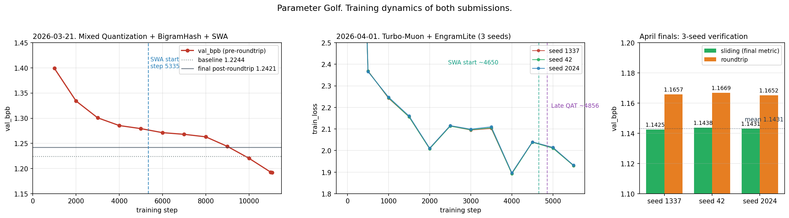

# Parameter Golf. A Personal Case Study

> A fork of the OpenAI Model Craft Challenge. Two submissions, one documented failure, and what I took away from three weeks of trying to fit a language model into sixteen megabytes.

## The short version

In spring 2026 I took part in the OpenAI Model Craft Challenge. The task fits in one sentence. Train a language model in ten minutes on 8×H100, pack it together with the code into an artifact smaller than 16 MB, get the best bits per byte on FineWeb validation. That's it.

Thirteen days, two public submissions, one instructive failure.

| Date | Technique | val_bpb | Artifact | H100 time | Pull Request |
|---|---|---|---|---|---|
| 2026-03-21 | Mixed Quantization + BigramHash + SWA | 1.2421 | 13.28 MB | 600 s | [openai/parameter-golf#370](https://github.com/openai/parameter-golf/pull/370) |
| 2026-04-01 | Turbo-Muon + EngramLite + VE(8,9,10) | 1.1431 (mean of 3 seeds) | 15.99 MB | 591 s | [openai/parameter-golf#1205](https://github.com/openai/parameter-golf/pull/1205) |

The leaderboard top on March 20th stood at 1.1428. My April result sits about 0.003 bpb away from that number. The baseline provided by the organizers gave 1.2244.

The gap between my first and second submission reads like a story about discipline. The first was put together in one night after an ambitious stack called `020_ultimate` failed. The second was made ten days later, calmly, on top of a well-documented top PR, with 3-seed verification.

## What Parameter Golf is

Parameter-constrained training tasks have been around for years. The Kaplan and Hoffmann scaling laws describe how quality grows predictably with compute and data budgets. Parameter Golf turns the question sideways. Fix the artifact size, fix the training time, see which combination of architecture and quantization squeezes the most out.

The rules leave very little room for tricks. Memory budget for the final model plus training code plus decoding code: sixteen megabytes. Training time on 8×H100 SXM: exactly ten minutes of wall clock. The metric is bits per byte on the FineWeb validation split, computed as `val_loss / log(2)` normalized by utf-8 length so different tokenizers compete on equal footing. Lower is better.

The organizers' baseline is a 9-layer GPT with dim=512 and vocab=1024, tied embeddings, int8+zlib quantization of the final weights. That baseline scores 1.2244 bpb.

My job as a participant: squeeze out more.

## Why this repository is interesting

Most forks of public challenges look the same. Someone clones upstream, adds one folder with their submission, writes a terse machine-generated README. You get a folder that tells you how. Not what the author was thinking, what they tried, where they went wrong, why.

I did it differently. What lives in this repository is a working journal. A full list of what I studied, verified results, two post-mortems on failures, a walk through each technique I applied, a script that turns my training logs into plots, and the production code of both submissions exactly as it ran on the H100, without after-the-fact polish.

If you're looking at this for hiring purposes or for your own entry into the next iteration, here's what you can take away.

A living working method. Not a result in a vacuum, but what I did on Monday when I realized my configuration didn't fit the budget, and what I decided to try on Tuesday. [docs/EXPERIMENTS.md](docs/EXPERIMENTS.md) has the story of `020_ultimate`, my attempt to stack everything I'd learned into one script, which scored 1.4143. That's 0.19 bpb worse than baseline. Full log, post-mortem, five named reasons it failed.

A deep technical breakdown. [docs/METHODS.md](docs/METHODS.md) walks through each method: what Muon is, why Newton Schulz fits batched weights, how Straight-Through Estimator makes quantization differentiable, why SWA beats EMA for post-training quantization (the reason is geometric: flat vs sharp optima), why BigramHash saves attention compute.

Clear boundaries between my work and other people's. I explicitly mark which techniques I took from upstream PRs, and whose, and which I combined myself. My two submissions are configurations I built and ran. Some of the features inside them come from public PRs by other participants, referenced by number.

## The story by date

Three weeks from cloning upstream to the second submission. Full journal with files and logs in [docs/EXPERIMENTS.md](docs/EXPERIMENTS.md). Short version below.

**March 17 to 20.** Cloned upstream. Ran the baseline on my local two 3090 Ti to confirm the scripts build. Got val_bpb 1.30 at step 4000 after about 80 minutes. On one 3090 you can't get a competitive result in 600 seconds, that's clear immediately. In parallel I read upstream PRs and pulled their train_gpt.py variants into a `parameter-golf-scripts` folder for study: PR #42 on FP16 tied embeddings, PR #50 on sliding window eval, PR #63 on Seq2048, PR #162 on SmearGate + BigramHash, PR #180 on 10L Int5-MLP + SWA, PR #1089 on Turbo-Muon. I collected my combinations of these techniques in local scripts.

**March 21.** Rented 8×H100 SXM on RunPod for a day. Decided to go all in: put together `020_ultimate`, a script where everything I'd read that week sits in one configuration. Twelve layers of SwiGLU, XSA on the last four layers, Chunked Window Attention, Partial RoPE, EMA, Label Smoothing, BigramHash 8192×96, Spectral init. Eleven new components at once.

The whole thing fell apart. Pre-quant 1.57, post-quant **1.4143**. That's 0.19 bpb worse than the organizers' baseline. Full breakdown in [docs/EXPERIMENTS.md](docs/EXPERIMENTS.md), short version: SwiGLU is about one and a half times slower per step than ReLU² (three matmuls instead of two), which means 6601 steps instead of 11000. Window attention warmup doesn't converge in 600 s. EMA is worse than SWA for quantization. Too many untested features at once.

Two hours left before the submission deadline. I assembled `025_optimized` from minimally-proven features: 11 layers of ReLU² 3x, BigramHash(10240), SmearGate, OrthoInit, Muon WD=0.04, SWA every 50 steps, Mixed INT6/INT8 STE, zstd-22. No XSA, no SwiGLU, no window attention. 11 070 steps in 600 s, pre-quant 1.1924, post-quant **1.2421**.

Opened PR #370 at 20:43 UTC. Went to bed at five.

**March 22 to 31.** Ten days of taking stock and more attempts. Looked at the top submissions on the leaderboard, tried to put together my own Frankenstein combinations (v1_safe_merger, v2_soft_quant, v3_vrl_first, v5_ttt_killer in local workspace). None of these reached a completed H100 run with a saved log. Different reasons: one didn't fit the budget after quantization, another diverged on a smoke test, a third needed careful calibration I didn't do.

The main observation from this period. To reach leader-level numbers (1.14 and below), you need genuinely fine GPTQ Hessian calibration with selective pruning. Top submissions work not because of a magical new architecture, but because of quantization polished down to int5 with 20% pruning. That takes several runs and precise tuning. I didn't have the RunPod budget for that.

I switched strategy. Instead of inventing my own stack, take the cleanest top base from upstream and tune hyperparameters with 3-seed verification. I picked PR #1089 (Turbo-Muon + EngramLite) as the base because its README was the most detailed and the code the most readable.

**April 1.** Seven hyperparameters tuned relative to PR #1089. LR raised from 0.025 to 0.030, warmdown from 3500 to 4500 steps, momentum warmup sped up from 1500 to 1000, VE_LAYERS widened from [9, 10] to [8, 9, 10], NGRAM_BUCKETS increased from 8192 to 10240, NGRAM_DIM_PER_HEAD from 32 to 48. Three independent seed runs.

Results per seed: 1.1425, 1.1438, 1.1431. Mean **1.1431**, standard deviation 0.0007. Time 591 seconds per seed, peak memory 24.8 GiB on an H100.

Opened PR #1205 with a full README, three seed logs, and metadata for independent verification.

Final status: 1.1431 mean, 0.003 bpb from the March 20 leaderboard top (1.1428), 0.08 bpb better than my first submission.

## The two submissions in detail

Both live in [records/track_10min_16mb/](records/track_10min_16mb/).

### 2026-03-21. Mixed Quantization + BigramHash + SWA

Directory: [records/track_10min_16mb/2026-03-21_MixedQuant_BigramHash_SWA/](records/track_10min_16mb/2026-03-21_MixedQuant_BigramHash_SWA/)

Configuration:

| Parameter | Value |
|---|---|
| Layers | 10 |
| model_dim | 512 |
| num_heads / num_kv_heads | 8 / 4 (GQA) |
| MLP | ReLU² 3x expansion (hidden=1536) |
| vocab_size | 1024 BPE |
| train_seq_len | 1024 |
| tied embeddings | yes |
| BigramHash | 10240 buckets × 128 dim |
| Optimizer | Muon WD=0.04, grad_clip=0.3 |
| matrix_lr / scalar_lr / tied_embed_lr | 0.02 / 0.04 / 0.05 |
| warmdown_iters | 1500 |
| SWA | every 50 steps from 50% of training |
| momentum warmup | 0.85 to 0.99 over 1500 steps |
| Quantization | Mixed INT6 (weights) + INT8 (embeddings), STE |
| Compression | zstd-22 |

Results: val_bpb 1.2421 post-roundtrip, 1.1924 pre-roundtrip. Quantization gap 0.0497. Artifact 13 279 428 bytes. 11 070 steps in 600 seconds, 54.2 ms per step. 115 SWA snapshots averaged.

Honest note from the submission README. Pre-roundtrip 1.19 would be competitive, but int6 quantization added 0.05 bpb. Top submissions hold that gap between 0.01 and 0.02. A better STE schedule or per-channel quantization could help, but I didn't have time to try in the hours I had left.

Read in full: [submission README](records/track_10min_16mb/2026-03-21_MixedQuant_BigramHash_SWA/README.md) and [train.log](records/track_10min_16mb/2026-03-21_MixedQuant_BigramHash_SWA/train.log).

### 2026-04-01. Turbo-Muon + EngramLite + VE(8,9,10)

Directory: [records/track_10min_16mb/2026-04-01_TurboMuon_EngramLite_Improved/](records/track_10min_16mb/2026-04-01_TurboMuon_EngramLite_Improved/)

Base: upstream PR #1089 Turbo-Muon stack.

Deltas relative to PR #1089:

| Parameter | PR #1089 | Mine | Reason |
|---|---|---|---|
| matrix_lr | 0.025 | 0.030 | Faster convergence in 600 s |
| scalar_lr | 0.025 | 0.030 | Matched to matrix_lr |
| warmdown_iters | 3500 | 4500 | Smoother weight averaging in the tail |
| muon_momentum_warmup_steps | 1500 | 1000 | Reach target momentum 0.99 sooner |
| VE_LAYERS | 9, 10 | 8, 9, 10 | Extra token identity on the middle layer |
| NGRAM_BUCKETS | 8192 | 10240 | Wider n-gram coverage |
| NGRAM_DIM_PER_HEAD | 32 | 48 | Denser n-gram embedding |

Full architecture: 11 layers × 512 dim × 8 heads × 4 KV GQA, MLP 3.5× with LeakyReLU(ASQU v3 per-layer slopes)², XSA on all 11 layers, EngramLite 2 heads × 2 orders (bigram + trigram), 10240 buckets × 48 dim per head, U-Net gated skip connections, Partial RoPE (16 of 64 dims), LN Scale 1/√(layer+1), Logit Softcap 30.0, ValueEmbedding on layers 8, 9, 10, SmearGate, tied embeddings, vocab 1024, train_seq_len 2048.

Optimizer groups:

| Group | LR | Settings |
|---|---|---|
| Bank weights (Turbo-Muon) | 0.030 | momentum=0.99, WD=0.04, NS=4, post_norm=row_col |
| Embeddings (Adam) | 0.6 | betas=(0.7, 0.95), WD=0.04 |
| Head / tied embed (Adam) | 0.035 | betas=(0.7, 0.95) |
| Scalars (Adam) | 0.030 | betas=(0.9, 0.95) |

Quantization: GPTQ with Hessian-aware Cholesky error compensation, I reserve 9 seconds out of the 600-second budget for calibration. Dynamic mixed precision int5 base on all 66 weight groups, none promoted to int6 or int7. Selective pruning: 20.5% of ±1, ±2 values to fit 16 MB. Brotli-11 + byte-shuffle for the final packaging. Late QAT with a soft-round sigmoid alpha ramp (threshold=0.15).

Weight averaging: SWA float32 accumulation every 50 steps after warmdown threshold, 18 snapshots. EMA with decay=0.997 on top of SWA.

Results across three seeds:

| Seed | step_avg | steps | val_bpb sliding | val_bpb roundtrip | Artifact |
|---|---|---|---|---|---|
| 1337 | 106.74 ms | 5 538 | 1.1425 | 1.1657 | 15 988 293 |
| 42 | 106.09 ms | 5 572 | 1.1438 | 1.1669 | 15 978 184 |
| 2024 | 106.00 ms | 5 576 | 1.1431 | 1.1652 | 15 985 158 |
| **Mean** | **106.28 ms** | **5 562** | **1.1431** | **1.1659** | |

Standard deviation across sliding val_bpb: 0.0007. A low spread like this means the result is reproducible and doesn't hang on a lucky seed.

Read in full: [submission README](records/track_10min_16mb/2026-04-01_TurboMuon_EngramLite_Improved/README.md), all three [train_seed*.log](records/track_10min_16mb/2026-04-01_TurboMuon_EngramLite_Improved/) are in the folder.

## Training curves



Three panels.

**Left.** Val_bpb trajectory for the March run. The red line is pre-roundtrip val_bpb, what the model sees during training. The dashed gray is the organizers' baseline (1.2244). The solid black is the final post-roundtrip (1.2421). You can see how SWA (vertical blue line, step 5335) helps stabilize the tail of the loss descent.

**Center.** Train loss for the three seeds of the April run. The curves track almost exactly on top of each other, which is visual evidence of reproducibility. SWA kicks in at step 4650, Late QAT at 4856. After that the model smoothly learns to live with quantization.

**Right.** Final val_bpb on all three seeds. Green bars are the sliding-window metric (the final one that goes on the leaderboard). Orange is standard roundtrip. The horizontal line is the mean 1.1431. The spread across seeds sits in the third decimal.

The script that renders this plot is in [scripts/plot_curves.py](scripts/plot_curves.py). It parses the logs with regex and only needs matplotlib.

## Hardware and budget

Local machine for baseline and calibrations: a workstation with three cards (two RTX 3090 Ti and one RTX 3090, all 24 GiB). Baseline was run at around 1.2 s per step to compare trends, and 50-step smoke tests to check that the script didn't crash. For the real submission runs I rented 8×H100 80GB SXM on RunPod.

Two final runs of 600 seconds each: 20 minutes at 0.40 dollars per minute, about eight dollars. Plus `020_ultimate` calibration runs (seven smoke tests of 50 steps plus one 2000-step run), another five to ten dollars. Total H100 time: roughly fifteen to twenty dollars.

The MLX version of the script (`train_gpt_mlx.py` in upstream) was not run on a Mac, MLX isn't installed on my Linux box. Smoke tests were enough on the local 3090.

## What's in this repository

```
parameter-golf/
├── README.md                         (this file)
├── docs/
│   ├── UPSTREAM_README.md            Original OpenAI README preserved for context
│   ├── METHODS.md                    Technical breakdown of each technique
│   └── EXPERIMENTS.md                Full journal with verified runs and post-mortems
├── records/
│   └── track_10min_16mb/
│       ├── 2026-03-21_MixedQuant_BigramHash_SWA/         First submission, 1.2421
│       └── 2026-04-01_TurboMuon_EngramLite_Improved/     Second submission, 1.1431
├── scripts/
│   └── plot_curves.py                Plot training curves from train.log
├── assets/
│   └── loss_curves.png               Training dynamics of both submissions
├── train_gpt.py                      Upstream baseline
├── data/                             FineWeb preparation scripts
├── LICENSE
├── THIRD_PARTY_NOTICES.md
└── requirements.txt
```

Other directories under `records/` are submissions by other participants that got merged into `openai/main` and came to my fork through synchronization. They aren't mine. Only the two folders dated 2026-03-21 and 2026-04-01 are mine.

## How to reproduce

If you want to run the submission yourself, you need an 8×H100 instance and about ten minutes of wall time.

Data:

```bash
git clone https://github.com/openai/parameter-golf.git
cd parameter-golf
python3 data/cached_challenge_fineweb.py --variant sp1024 --train-shards 80
```

First submission (1.2421):

```bash
cp records/track_10min_16mb/2026-03-21_MixedQuant_BigramHash_SWA/train_gpt.py ./
torchrun --standalone --nproc_per_node=8 train_gpt.py
```

Second submission (1.1431):

```bash
cp records/track_10min_16mb/2026-04-01_TurboMuon_EngramLite_Improved/train_gpt.py ./
SEED=1337 torchrun --standalone --nproc_per_node=8 train_gpt.py
```

For full 3-seed verification, run it three times with SEED=1337, SEED=42, SEED=2024. The mean should match 1.1431 within 0.001.

Requirements: CUDA 12.8+, PyTorch 2.8+, 8 cards with bf16, 80 GiB per card. On a single H100 the script runs with smaller parallelism and longer time, but the numbers will differ.

## What's not here

For fairness: this repository doesn't tell the whole story.

No code for all the intermediate experiments. Most of them were messy hacky edits of the same `train_gpt.py`, I didn't save each version to git. They're described in the journal but not reproducible step by step.

No code for the failed v1 through v5 Frankenstein mergers. They live in my local workspace, I don't push them because they don't work. If you want them for study, open an issue and I'll attach them.

No charts for every metric. `scripts/plot_curves.py` draws the two main ones. The rest is trivial to extend if needed.

No leaderboard screenshots. OpenAI updates the leaderboard dynamically. My relative positions are reconstructed from pull request dates, not from screenshots.

## Contact

If you're reading this and have questions about the code, configuration, or methods, open an issue in this repository or reach out directly. If you're entering the next iteration of Parameter Golf and want to discuss ideas: happy to.

---

Upstream: [openai/parameter-golf](https://github.com/openai/parameter-golf)

Author: Serghei Brinza, AI engineer. Other projects: [github.com/SergheiBrinza](https://github.com/SergheiBrinza)

Last update: April 2026
