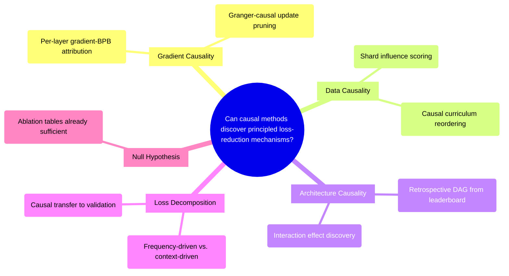

# PRD: Causal Inference for Parameter-Efficient LM Training

## Status
- Created: 2026-03-24
- Last updated: 2026-03-24
- Status: Draft
- Problem Type: Research/Scientific
- Archetype: data-ml-project

## Problem Statement
The parameter golf challenge (16MB artifact, 10min on 8xH100, FineWeb BPB) has been dominated by empirical engineering stacking — int6 QAT, EMA, XSA, GPTQ-lite, partial RoPE — where each trick is discovered by trial-and-error ablation. No participant has applied formal causal inference methods to understand *why* loss drops, which mechanisms are genuinely causal vs. confounded, or which data causally drives generalization. This represents a methodological gap: if we can identify the causal structure of training dynamics, we can shortcut to the signal that matters and achieve better BPB with less data or fewer parameters.

### Evidence
- No participant has reported using formal causal methods (ATE-based pruning, influence functions, Granger-causal filtering) in parameter golf — Evidence: GitHub issue #140 community discussion
- The Gradient-Causal Gap paper (arXiv 2602.01442) shows gradient magnitude and causal importance diverge as task complexity grows (Pearson rho drops from 0.73 to -0.11) — Evidence: https://arxiv.org/abs/2602.01442
- MATES (NeurIPS 2024) halves FLOPs to target performance via causal data selection on 410M-1B models — Evidence: https://arxiv.org/abs/2406.06046
- Granger-causal pruning (arXiv 2412.03035) reframes gradient descent as implicit Granger-causal process and reveals phase-shift at optimal pruning fraction — Evidence: https://arxiv.org/abs/2412.03035
- The existing leaderboard records already constitute a quasi-experimental dataset (15+ entries with 1-4 intervention diffs and BPB outcomes) — Evidence: codebase analysis

## Goals
1. Use causal inference as a discovery tool to uncover principled mechanisms of loss reduction in parameter-constrained LM training
2. Translate causal findings into a competitive parameter golf submission (~1.12 BPB or better)
3. Establish whether causal methods provide actionable signal beyond ad-hoc ablation in this constrained regime

## Success Criteria
### Scientific Success (causal discovery)
- [ ] At least one causal experiment achieves same constraints with lower loss vs. baseline (same 16MB, lower BPB)
- [ ] OR at least one causal experiment achieves same loss with less data (fewer training tokens, same BPB)
- [ ] Findings are reproducible across 3 seeds at p < 0.01 (BPB improvement must be >= 0.002 minimum detectable effect to count as confirmed; sub-threshold improvements reported as suggestive only)
### Competition Success (submission)
- [ ] Competitive submission produced (target: ≤1.12 BPB, 3-seed mean)
- [ ] Note: Engineering fallback (composing existing tricks without causal novelty) is a valid path if all causal angles produce null results

### Statistical Power Note
With n=3 seeds per condition, sigma=0.0005 BPB, alpha=0.01 (two-sided), power=0.80: minimum detectable effect ~0.002 BPB. Individual leaderboard improvements (e.g., GPTQ-lite at 0.0006, EMA at 0.0006) are below this threshold. Experiments should target aggregate effects or increase seed count to n=5+ for fine-grained attribution.

## User Stories
### Story 1: Causal Experiment Design
**As a** researcher competing in parameter golf **I want** a framework to run causal experiments on the training process **So that** I can distinguish which training choices genuinely cause BPB improvement vs. are confounded

**Acceptance criteria:**
- Can run controlled ablation experiments with paired seed design
- Can measure causal effect sizes with bootstrapped confidence intervals
- Results distinguish causal from correlational findings

### Story 2: Actionable Training Improvement
**As a** competitor **I want** causal findings to translate directly into training script modifications **So that** the discovery phase produces a submittable run, not just analysis

**Acceptance criteria:**
- Each causal finding maps to a concrete code change in train_gpt.py or train_gpt_mlx.py
- Modified scripts run within 10min on 8xH100 and produce ≤16MB artifacts

## Use Cases
### UC-1: Retrospective Causal Analysis
**Actors:** Researcher | **Preconditions:** Leaderboard records exist with ablation tables
**Flow:** 1. Extract intervention-outcome pairs from 15+ leaderboard records 2. Fit structural causal model (DAG) over architectural choices and BPB outcomes 3. Identify independent causal effects vs. interaction effects
**Postconditions:** Causal DAG over {quantization, MLP multiplier, attention variant, positional encoding, weight averaging} → BPB
**Edge cases:** Confounding from simultaneous changes — address via partial identification bounds

### UC-2: Prospective Gradient-Causal Experiment
**Actors:** Researcher | **Preconditions:** Baseline train_gpt_mlx.py runs locally
**Flow:** 1. Add gradient norm logging to MLX training loop 2. Run paired experiments (treatment vs. control) with 3 seeds each 3. Compute per-layer gradient-BPB causal attribution
**Postconditions:** Identified which layers/components causally drive loss reduction at each training phase
**Edge cases:** Non-stationarity from Muon momentum warmup — stratify analysis by training phase

### UC-3: Data Influence Scoring
**Actors:** Researcher | **Preconditions:** Saved checkpoints from baseline run
**Flow:** 1. Implement gradient inner product proxy (Hessian-free) 2. Score training shards by alignment with validation loss gradient 3. Reorder shards by causal influence score and retrain
**Postconditions:** Data ordering that causally prioritizes generalizable tokens
**Edge cases:** All shards may have similar alignment with 1024-vocab FineWeb — detect via variance of scores

## Edge Cases & Error Handling
| Scenario | Expected Behavior | Rationale |
|----------|-------------------|-----------|
| Causal effect size below seed variance (~0.0005 BPB) | Report null result, do not claim improvement | Statistical honesty; challenge requires p < 0.01 |
| MLX findings don't replicate on H100 | Treat MLX as hypothesis generation only; validate on H100 before claiming | Quantization, FlashAttention 3, multi-GPU behavior differ |
| QAT STE corrupts gradient-based signals | Stratify analysis to pre-QAT training window only | STE creates gradient discontinuity invalidating influence assumptions |
| All 4 causal angles produce null results | Pivot to direct engineering stacking | Null results are valid scientific outcomes; competition has a deadline |

## Constraints
### Behavioral Constraints (Must NOT do)
- Must NOT claim causal effects without paired seed design (≥3 seeds per condition) — Rationale: Inter-seed std ~0.0005 BPB makes single-run comparisons meaningless
- Must NOT use IHVP-based influence functions inside the 10-min training loop — Rationale: Computationally infeasible at 85ms/step with no headroom
- Must NOT train on validation data — Rationale: Challenge rules explicitly prohibit this

### Technical Constraints
- 16MB artifact size (code + compressed model, 16,000,000 bytes decimal) — Evidence: Challenge rules
- 10-minute training on 8xH100 SXM — Evidence: Challenge rules
- 10-minute evaluation time limit — Evidence: Challenge rules
- Local iteration on Apple Silicon MLX; MLX lacks FlashAttention and torch.compile, resulting in 10-30x slower throughput than H100 — Evidence: Codebase analysis
- torch.compile constant-folds class attributes, making Late QAT dead code — Evidence: PR #287 post-mortem
- Muon optimizer with Newton-Schulz orthogonalization is not standard SGD — influence function theory may not directly apply — Evidence: Data science advisor analysis

## Requirements
### Functional
- FR-1: Retrospective causal DAG estimation from existing leaderboard ablation data (no new training runs required)
- FR-2: Gradient inner product influence proxy script for MLX (~50 lines), runnable on saved checkpoints
- FR-3: Paired seed experiment runner (3 seeds × 2 conditions minimum per hypothesis)
- FR-4: Per-layer, per-phase gradient attribution logging in train_gpt_mlx.py
- FR-5: Data shard influence scoring and reordering pipeline

### Non-Functional
- NFR-1: Causal diagnostic scripts must run on Apple Silicon MLX within 2 hours for local iteration
- NFR-2: No causal instrumentation overhead in final submission runs (diagnostics are offline)
- NFR-3: All causal claims must include effect size, confidence interval, and seed count

## Non-Goals
- Building a general-purpose causal inference library — Rationale: We need scripts, not a framework
- Proving theoretical guarantees about causal identification — Rationale: Competition deadline; empirical evidence sufficient
- Beating SOTA through causal methods alone — Rationale: Causal insights should compose with existing engineering tricks (EMA, GPTQ-lite, XSA)

## Out of Scope (This Release)
- Full IHVP-based influence functions — Future consideration: If someone contributes a fast IHVP kernel for H100
- Multi-token prediction (MTP) causal analysis — Future consideration: MTP is currently disabled in top submissions
- Test-time training (TTT) causal analysis — Future consideration: LoRA TTT achieved 1.1928 but is a separate submission track

## Research Summary
### Internet Research
- Granger-causal pruning reframes gradient descent as implicit Granger-causal process; reveals phase-shift at optimal pruning fraction producing flatter minima — Source: https://arxiv.org/abs/2412.03035
- Gradient-Causal Gap: gradient magnitude diverges from causal importance on complex tasks; "Hidden Heroes" (low-gradient, causally critical) and "Gradient Bloats" (high-gradient, noise) — Source: https://arxiv.org/abs/2602.01442
- MATES (NeurIPS 2024): model-aware data selection halves FLOPs to target performance via continuous influence probing — Source: https://arxiv.org/abs/2406.06046
- TRAK: scalable data attribution via random-projected gradient features; 100x faster than comparable methods — Source: https://proceedings.mlr.press/v202/park23c/park23c.pdf
- Causal Scrubbing: do-calculus-style interventionist method for testing which circuits causally produce behavior — Source: https://www.alignmentforum.org/posts/JvZhhzycHu2Yd57RN/causal-scrubbing-a-method-for-rigorously-testing
- Model Compression via ATE: prune components with near-zero Average Treatment Effect on predictions — Source: https://direct.mit.edu/tacl/article/doi/10.1162/tacl_a_00431
- Causal Abstraction (JMLR 2025): unified theoretical framework for mechanistic interpretability enabling principled compression — Source: https://arxiv.org/abs/2301.04709
- No participant in parameter golf has used formal causal methods — confirmed gap — Source: https://github.com/openai/parameter-golf/issues/140

### Codebase Analysis
- Baseline: 9-layer GPT, 512-dim, 1024-vocab, tied embeddings, RoPE, U-Net skips, Muon optimizer — Location: train_gpt.py
- Top submission (1.1233 BPB): 11L, 3x MLP, XSA on last 4 layers, SmearGate, BigramHash, Partial RoPE, LN Scale, EMA, GPTQ-lite, zstd-22 — Location: records/track_10min_16mb/2026-03-22_*/train_gpt.py
- GPTQ-lite is already a causal intervention (vary clip percentile, measure MSE) delivering competitive gains at zero training cost — Location: records/track_10min_16mb/2026-03-22_*/train_gpt.py:885-904
- Training loop has no explicit hook callbacks; causal analysis must be inserted inline at 5 natural extension points — Location: train_gpt.py:1007-1055
- MLX variant uses nn.value_and_grad for autodiff; gradient inner product probes are feasible via this API — Location: train_gpt_mlx.py:909-912
- Late QAT is dead code due to torch.compile constant-folding — Location: PR #287 post-mortem

### Existing Capabilities
- Leaderboard ablation tables provide 15+ quasi-experimental data points for retrospective causal analysis
- EMA state provides counterfactual checkpoints (EMA vs. raw weights) for ablation
- forward_logits() method in top submissions enables per-token loss decomposition without reduction

## Structured Analysis

### Problem Type
Research/Scientific — Hypothesis-driven investigation into causal mechanisms of training efficiency in parameter-constrained LM training

### SCQA Framing
- **Situation:** Parameter golf competitors have driven BPB from 1.2244 to 1.1228 by stacking engineering tricks (QAT, EMA, XSA, GPTQ-lite, partial RoPE). Each trick is discovered via ad-hoc ablation and trial-and-error tuning.
- **Complication:** No one has applied formal causal inference to understand *why* these tricks work, which are genuinely causal vs. confounded, or whether principled causal analysis could discover more efficient paths. The Gradient-Causal Gap paper shows gradient magnitude diverges from causal importance on complex tasks, suggesting current ablation practices may miss "Hidden Heroes" and waste effort on "Gradient Bloats."
- **Question:** Can causal inference methods discover principled mechanisms of loss reduction that translate to better BPB with less data or fewer parameters?
- **Answer:** Run experiments sequentially by priority (architecture causality → loss decomposition → gradient selection → data curriculum), with a 2-day decision gate after each: if no effect > 0.002 BPB, pivot to direct engineering. Use the existing leaderboard as retrospective quasi-experimental data and targeted prospective experiments on MLX/H100, then engineer the highest-signal findings into a competitive submission.

### Decomposition

```
Can causal methods discover principled loss-reduction mechanisms?
├── H1: Gradient updates have heterogeneous causal effects on BPB
│   ├── P1a: If H1, per-layer gradient norms will correlate differently with val_loss reduction across training phases
│   └── P1b: If H1, pruning low-causal-effect updates will maintain BPB with fewer effective parameters
├── H2: Training data shards have heterogeneous causal effects on generalization
│   ├── P2a: If H2, gradient inner product between shard gradients and val gradient will vary significantly across shards
│   └── P2b: If H2, reordering shards by influence score will reach target BPB with fewer tokens
├── H3: Architectural components have independent vs. interacting causal effects
│   ├── P3a: If H3, the retrospective DAG will show non-zero interaction terms between components
│   └── P3b: If H3, there exist unexplored component combinations with better BPB than current stacking order
├── H4: Training loss decomposes into causally transferable vs. confounded components
│   ├── P4a: If H4, per-token loss variance will partition into frequency-driven (confounded) and context-driven (causal) components
│   └── P4b: If H4, training on high-causal-transfer tokens will improve BPB more efficiently
└── H0: All observed BPB improvements are adequately explained by existing ablation practice
    └── P0: Causal analysis reproduces the same ranking of interventions as ad-hoc ablation tables
```

### Mind Map


## Strategic Analysis

### Data Science Domain
- **Methodology Assessment:** The approach legitimately inverts causal inference — treating the training process as the system under study. The four angles span distinct experimental paradigms. Gradient selection conflates correlation with causation in non-convex optimization. Data curriculum aligns with do-calculus intuitions but effect sizes may be below measurement resolution (~0.0005 BPB seed variance) with only ~5.5B tokens in 10 minutes. Architecture search is the most empirically tractable and is implicitly what leaderboard leaders already do. Loss decomposition is epistemically ambitious — calling it causal requires careful handling of distribution shift and quantization gap (~0.017 BPB).
- **Key Pitfall Risks:** (1) Confounding between optimizer phases and architectural effects — the Muon warmup, wallclock caps, and QAT create a highly non-stationary system. (2) Quantization gap as structural confound — pre-quant vs. post-quant BPB delta of ~0.017 is causally downstream of every choice. (3) Multiple comparisons across four angles without pre-registration risks p-hacking.
- **Modeling Approach:** Retrospective quasi-experimental analysis of existing leaderboard records (no new runs), plus targeted prospective ablations on two highest-leverage angles. Priority order: architecture interventions (highest ROI), GPTQ-lite extension, loss decomposition, data curriculum (lowest ROI given constraints). Paired seed design with bootstrapped CIs.
- **Recommendation:** Pre-register specific causal hypotheses. Use existing ablation tables as quasi-experimental data. Separate quantization-gap analysis from training-dynamics analysis. Use proxy metrics (gradient norms, weight-update magnitudes) that can be logged without additional runs.
- **Evidence Quality:** moderate

### Pre-mortem
- **Core Finding:** The causal inference framing will most likely fail not because the science is wrong, but because the 10-minute, 8xH100 constraint collapses the experiment-iteration cycle to the point where causal signals cannot be distinguished from noise before the competition closes.
- **Analysis:** The leaderboard was conquered in 5 days by pure engineering stacking — each record is a tightly controlled ablation of a specific trick, not a causal discovery exercise. A proper causal experiment requires 3-5 seed averages per condition; with 10-min H100 runs at ~$3-5 each, even a 2x2 factorial burns 12 runs, ~$36-60, and days of wall-clock time. The "I told you so" narrative: the team spent two weeks designing experiments instead of shipping quantization and architecture tweaks, joining at 1.18 when SOTA was 1.12. Second failure mode: the four causal angles are underspecified as interventions — gradient selection is confounded by LR and batch size, curriculum is confounded by ordering-timing interaction, architecture search is combinatorial (not causal), and loss decomposition produces insights hard to convert into submissions.
- **Key Risks:** Insufficient statistical power within time/cost budget; confounded interventions; opportunity cost vs. direct engineering; MLX-to-H100 validity gap; sliding-window eval asymmetry; moving SOTA target (~0.01 BPB/day).
- **Recommendation:** Reframe as a tightly scoped 2-day spike with hard decision gate: pick one low-confound intervention, run 3-seed ablations on 1xH100, and commit to converting findings into a submission within 48 hours — or pivot to direct engineering.
- **Evidence Quality:** strong

### Feasibility
- **Core Finding:** Classical influence functions (IHVP-based) are infeasible within the training budget, but lightweight causal probes — gradient inner products, checkpoint diffs, per-layer attribution — are tractable as offline diagnostics. GPTQ-lite is already a causal intervention delivering competitive gains.
- **Analysis:** The SOTA runs 7,101 steps in 600s (~85ms/step) with no compute headroom for Hessian approximations. However, gradient-norm logging adds <1% overhead, checkpoint-diff ablations are free (implied by existing record structure), and Hessian-free influence proxies (gradient inner products) require only one extra backward per eval cadence. The competition's ablation discipline is already quasi-causal. MLX on Apple Silicon is confirmed viable for diagnostics — the repo ships train_gpt_mlx.py with full autodiff support. Key composability issue: QAT's straight-through estimator corrupts gradient signals during late training, requiring analysis to target pre-QAT window.
- **Key Risks:** IHVP computationally ruled out; QAT STE breaks gradient assumptions; Apple Silicon throughput gap (10-30x slower); data curriculum signals may be low-value with fixed FineWeb distribution; causal framing may relabel existing ablation practice.
- **Recommendation:** Treat causal inference as offline analysis on saved checkpoints, not in-training instrumentation. Cheapest proof-of-concept: gradient inner product script (~50 lines MLX) scoring training shards by validation gradient alignment — retires top feasibility risk in <2 hours local compute.
- **Evidence Quality:** moderate

## Review History

### Review 0 (2026-03-24)
**Findings:**
- [blocker] False codebase claim: MLX baseline does have U-Net skip connections (at: Constraints > Technical Constraints)
- [blocker] Incorrect API: mx.grad not used; actual API is nn.value_and_grad (at: Codebase Analysis)
- [warning] No timeline or decision gates despite pre-mortem recommending them (at: Next Steps)
- [warning] No multiple comparison correction for 4 hypotheses (at: Decomposition)
- [warning] Success criteria mix scientific and competition goals with OR logic (at: Success Criteria)
- [warning] Minimum detectable effect size answerable but left as open question (at: Open Questions)
- [warning] Internal disagreement: SCQA proposes 4 tracks, pre-mortem says 1 (at: SCQA Answer)

**Corrections Applied:**
- Fixed MLX constraint: removed false skip-connection claim, replaced with actual limitation (no FlashAttention, 10-30x slower) — Reason: blocker, factually wrong
- Fixed autodiff API: mx.grad → nn.value_and_grad with line reference — Reason: blocker, wrong API
- Added Timeline & Decision Gates section with sequential phases and hard pivot rule — Reason: warning, pre-mortem recommendation
- Added Holm-Bonferroni correction for multiple comparisons — Reason: warning, p-hacking risk
- Separated success criteria into Scientific and Competition sections with engineering fallback — Reason: warning, contradictory goals
- Computed and stated minimum detectable effect (~0.002 BPB) with implications — Reason: warning, answerable question
- Resolved scope disagreement: SCQA Answer now specifies sequential priority with 2-day decision gates — Reason: warning, internal contradiction

### Readiness Check 0 (2026-03-24)
**Result:** APPROVED (2 warnings, 1 suggestion)
**Findings:**
- [warning] Two open questions lack decision rules for when they invalidate hypotheses (at: Open Questions)
- [warning] Scientific success criteria ambiguous for sub-threshold improvements (at: Success Criteria)
- [suggestion] Next Steps too vague for Phase 1 start (at: Next Steps)

**Corrections Applied:**
- Added decision rules to open questions (DAG identifiability → skip Phase 2; quant gap → restrict claims) — Reason: warning
- Clarified minimum detectable effect as hard threshold for "confirmed" vs. "suggestive" findings — Reason: warning
- Added 4 concrete Phase 1 first actions to Next Steps — Reason: suggestion

## Open Questions
- Does the 1024-token vocabulary make training-to-validation gradient alignment trivially high everywhere, rendering data curriculum experiments uninformative?
- Can Muon optimizer's Newton-Schulz orthogonalization be modeled within the influence function framework, or does it break standard assumptions entirely?
- Is the retrospective leaderboard DAG identifiable given that most records change 2-4 variables simultaneously? **Decision rule:** If >50% of records change 3+ variables, skip architecture ablation (Phase 2) and proceed directly to Phase 3 (loss decomposition).
- Does the quantization gap (~0.017 BPB) dominate all training-side causal effects, making pre-quant causal analysis irrelevant to final scores? **Resolution:** Measure pre-quant and post-quant BPB in Phase 1; if quant gap > 3x the largest training-side causal effect, restrict all claims to post-quant outcomes only.

## Timeline & Decision Gates
Competition deadline: April 30, 2026. Experiments run sequentially with Holm-Bonferroni correction for multiple comparisons.

| Phase | Duration | Activity | Decision Gate |
|-------|----------|----------|---------------|
| 1. Retrospective DAG | 2 days | Analyze existing leaderboard ablation data (no new runs) | If DAG reveals unexplored interaction: proceed to Phase 2. If not: skip to Phase 3. |
| 2. Architecture ablation | 3 days | Test top DAG-suggested combination on MLX, validate on 1xH100 (3 seeds) | If effect > 0.002 BPB: engineer into submission. If null: proceed to Phase 3. |
| 3. Loss decomposition | 3 days | Per-token loss attribution, pre-quant vs. post-quant causal pathway | If actionable signal: engineer into submission. If null: proceed to Phase 4. |
| 4. Gradient/data probes | 3 days | Gradient inner product shard scoring on MLX | If effect > 0.002 BPB: validate on H100. If null: pivot to engineering. |
| 5. Engineering fallback | Remaining time | Compose best existing tricks into competitive submission | Submit best result by April 28. |

**Hard pivot rule:** If no causal angle produces detectable effect (>0.002 BPB) by end of Phase 4, abandon causal framing and pursue direct engineering stacking for remaining time.

## Next Steps
1. Extract intervention-outcome pairs from the 18 leaderboard READMEs into a structured table
2. Identify which records change only 1 variable (cleanest quasi-experimental data points)
3. Run retrospective DAG identifiability check — if >50% of records change 3+ variables, skip Phase 2
4. Measure pre-quant vs. post-quant BPB gap to determine if quantization dominates causal effects
5. Ready for /pd:create-feature to begin implementation
