# Detailed Implementation Plan: Instant Hadamard Projection Integration

## Overview

This plan details the specific code changes needed to integrate instant Hadamard projection into `train_gpt.py`, replacing the current pseudo-random vector generation methods.

## Files to Modify

- **Primary**: `records/track_10min_16mb/2026-03-20_HDC_Zero_Track_5Mb/train_gpt.py`

## Implementation Steps

### Step 1: Add Import Statements

**Location**: After existing imports (around line 50-60)

**Add**:
```python
from HDC_Core_Model.Recipes_Seeds.walsh_hadamard_core import WalshHadamardBasis
from HDC_Core_Model.Recipes_Seeds.difficulty_learning import DifficultyMemory, DifficultyClass
```

### Step 2: Initialize WalshHadamardBasis in HDCLanguageModel.__init__

**Location**: Inside `HDCLanguageModel.__init__` method, after line 2630 (after `self.semantic_codebook` initialization)

**Add**:
```python
# Instant Hadamard projection basis
self.hadamard_basis = WalshHadamardBasis(dim=self.dim, use_gpu=self.use_gpu)
```

### Step 3: Initialize DifficultyMemory in HDCLanguageModel.__init__

**Location**: After the hadamard_basis initialization

**Add**:
```python
# Difficulty memory for adaptive time budgeting
self.difficulty_memory = DifficultyMemory(dim=self.dim)
```

### Step 4: Replace get_token_vector Method

**Location**: Lines 2658-2666

**Current Code**:
```python
def get_token_vector(self, token_id: int) -> np.ndarray:
    """Get HDC vector for token (procedurally generated)."""
    if token_id not in self._token_cache:
        self._token_cache[token_id] = seed_to_hypervector(
            f"token_{token_id}", self.dim
        )
        # Register seed
        self.seed_registry.get_or_create(f"token_{token_id}")
    return self._token_cache[token_id]
```

**Replace With**:
```python
def get_token_vector(self, token_id: int) -> np.ndarray:
    """
    Get HDC vector for token using instant Hadamard projection.
    
    Uses WalshHadamardBasis.get_row_from_string() which:
    1. Hashes token_id to get Hadamard row index
    2. Returns the row as packed binary vector
    
    This provides perfect orthogonality between all tokens.
    """
    # Check cache first (for frequently used tokens)
    if token_id in self._token_cache:
        return self._token_cache[token_id]
    
    # Instant projection: hash(token) -> Hadamard row
    index, row = self.hadamard_basis.get_row_from_string(
        f"token_{token_id}", 
        packed=True
    )
    
    # Register the seed-index mapping
    self.seed_registry.get_or_create(f"token_{token_id}")
    
    # Cache for frequently used tokens (optional optimization)
    if len(self._token_cache) < 10000:  # Limit cache size
        self._token_cache[token_id] = row
    
    return row
```

### Step 5: Replace get_position_vector Method

**Location**: Lines 2668-2676

**Current Code**:
```python
def get_position_vector(self, position: int) -> np.ndarray:
    """Get HDC vector for position (procedurally generated)."""
    if position not in self._position_cache:
        self._position_cache[position] = hadamard_position_vector(
            position, self.dim
        )
        # Register seed
        self.seed_registry.get_or_create(f"hadamard_pos_{position}")
    return self._position_cache[position]
```

**Replace With**:
```python
def get_position_vector(self, position: int) -> np.ndarray:
    """
    Get HDC vector for position using direct Hadamard row indexing.
    
    Position directly maps to row index, providing:
    - Perfect orthogonality between positions
    - O(dim) generation time
    - No collisions ever
    """
    # Check cache first
    if position in self._position_cache:
        return self._position_cache[position]
    
    # Direct Hadamard row: position -> row index
    row = self.hadamard_basis.get_row(position, packed=True)
    
    # Register the seed-index mapping
    self.seed_registry.get_or_create(f"pos_{position}")
    
    # Cache for frequently used positions
    if len(self._position_cache) < 1000:
        self._position_cache[position] = row
    
    return row
```

### Step 6: Add Difficulty Estimation to learn_pattern Method

**Location**: Inside `learn_pattern` method (around line 2922-2971)

**Add after line 2940** (after `target_vec = self.get_token_vector(target)`):

```python
# Estimate difficulty for adaptive time budgeting
profile = self.difficulty_memory.estimate_difficulty(context_vec, target_vec)
time_budget = self.difficulty_memory.get_time_budget(profile)
```

**Add before the method returns** (before any return statement):

```python
# Record solve result for future difficulty estimation
self.difficulty_memory.record_solve(
    input_vec=context_vec,
    output_vec=target_vec,
    solve_time_ms=elapsed_time_ms,  # Need to track this
    strategy="xor_peeling",
    success=discovered_seeds is not None and len(discovered_seeds) > 0
)
```

## Architecture Flow Diagram

```mermaid
flowchart TD
    subgraph Current Implementation
        A1[get_token_vector] --> B1[seed_to_hypervector]
        B1 --> C1[BLAKE3 Hash]
        C1 --> D1[Pseudo-random Vector]
        
        A2[get_position_vector] --> B2[hadamard_position_vector]
        B2 --> C2[Circular Shift + XOR]
        C2 --> D2[Position Vector]
    end
    
    subgraph Instant Projection
        E1[get_token_vector] --> F1[hadamard_basis.get_row_from_string]
        F1 --> G1[hash token_id mod dim]
        G1 --> H1[Hadamard Row - Perfect Orthogonal]
        
        E2[get_position_vector] --> F2[hadamard_basis.get_row]
        F2 --> G2[position as index]
        G2 --> H2[Hadamard Row - Perfect Orthogonal]
    end
    
    subgraph Difficulty Learning
        I[learn_pattern] --> J[estimate_difficulty]
        J --> K[DifficultyProfile]
        K --> L[get_time_budget]
        L --> M[Adaptive Search Time]
        I --> N[record_solve]
        N --> O[Update Difficulty Memory]
    end
```



## Compatibility Verification

### XOR Binding Compatibility

The existing `xor_bind` function at line 571 uses `np.bitwise_xor()`:
```python
def xor_bind(a: np.ndarray, b: np.ndarray) -> np.ndarray:
    """XOR bind two hypervectors."""
    return np.bitwise_xor(a, b)
```

This works correctly with both:
- uint64 arrays (current format)
- packed uint8/uint64 arrays (Hadamard basis format)

**No changes needed** - `np.bitwise_xor` handles both formats correctly.

### Circular Temporal Encoding Compatibility

The `circular_temporal_encode` function at line 510 uses `np.roll()`:
```python
def circular_temporal_encode(...):
    # Uses np.roll() for position encoding
```

`np.roll()` works on packed binary format. **No changes needed**.

## Key Benefits of This Integration

| Aspect | Current | Instant Projection |
|--------|---------|-------------------|
| Orthogonality | Statistical ~0.5/dim | Perfect H[i]·H[j]=0 |
| Generation Time | O(dim × hash_time) | O(dim) |
| Collision Risk | Non-zero | Zero |
| Memory | Cache required | Cache optional |
| Reproducibility | Seed-dependent | Index-deterministic |

## Testing Strategy

1. **Unit Tests**:
   - Verify `get_token_vector(token_id)` returns consistent vectors
   - Verify `get_position_vector(position)` returns consistent vectors
   - Check orthogonality: `H[i] · H[j] ≈ 0` for i ≠ j

2. **Integration Tests**:
   - Run training for 100 steps
   - Verify recipe storage works
   - Check XOR peeling search still functions

3. **Performance Tests**:
   - Compare vector generation time before/after
   - Measure memory usage

## Rollback Plan

If issues arise:
1. Revert `get_token_vector` to use `seed_to_hypervector`
2. Revert `get_position_vector` to use `hadamard_position_vector`
3. Remove `hadamard_basis` and `difficulty_memory` initializations
4. Remove import statements

## Summary

This integration replaces pseudo-random vector generation with mathematically-guaranteed orthogonal Hadamard rows, providing:
- Perfect orthogonality between all tokens and positions
- Faster vector generation
- Zero collision risk
- Same discovery learning mechanisms (XOR Peeling, Resonator) continue to work