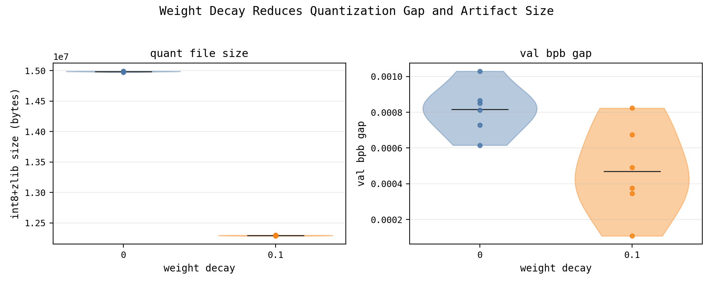

This record implements weight decay with scaled up model depth (9 to 12 layers), and smaller batch size (524288 to 131072 tokens) to fit within the 10-minute wallclock limit for the main leaderboard track.

> NOTE: This is a work-in-progress to be used for requesting feedback and compute grants from OpenAI.
> NOTE: I cannot yet confirm my results on 8xH100s due lack of access (all providers are currently sold out of H100s). I will update this record with H100 results as soon as I can.

---

Key findings:
- Weight decay significantly reduces (1) quantized artifact file size; and (2) the pre- vs. post-quantization validation loss and bits-per-byte gap.
  - Paired one-sided t-test on 6 seeds yielded `p=0.01226` for the reduction in quantization gap.
- With `weight_decay=0.1`, the reduction in artifact size is ~20%, allowing us to use larger models within the 16MB artifact size limit.



---

Trainer changes in this snapshot:
- added weight decay to the trainer

Command (track-relevant params):
```bash
NCCL_IB_DISABLE=1 \
RUN_ID=hf_verify_sp1024_8gpu_leloykun_weightdecayzip \
DATA_PATH=/root/code/parameter-golf/data/datasets/fineweb10B_sp1024 \
TOKENIZER_PATH=/root/code/parameter-golf/data/tokenizers/fineweb_1024_bpe.model \
VOCAB_SIZE=1024 \
MAX_WALLCLOCK_SECONDS=600 \
TRAIN_LOG_EVERY=50 \
VAL_LOSS_EVERY=200 \
WEIGHT_DECAY=0.1 \
NUM_LAYERS=12 \
MATRIX_LR=0.02 \
TRAIN_BATCH_TOKENS=131072 \
torchrun --standalone --nproc_per_node=8 /root/code/parameter-golf/train_gpt.py
```
