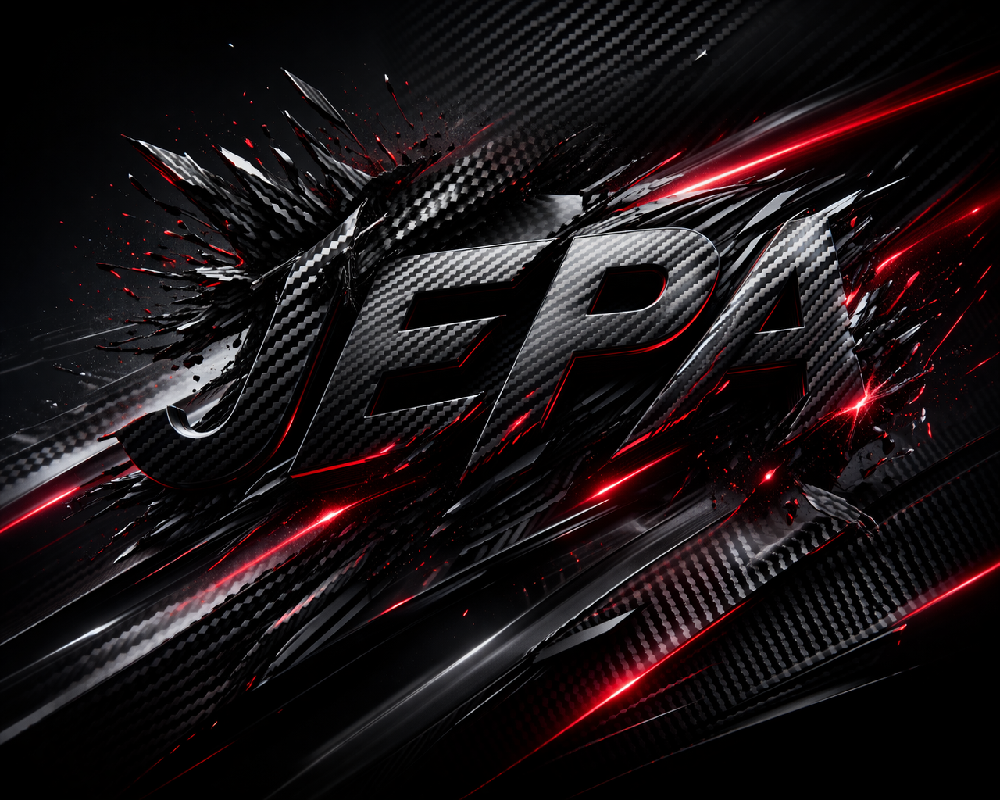

# JEPA + AdamW TTT + Full GPTQ + FA3 — 1.1085 BPB

## Results

| Seed | val_bpb | bytes_total |
|------|---------|-------------|
| 1337 | **1.1085** | 15,977,978 |

## The Journey

This submission is the result of an independent, self-funded research effort that spanned two weeks, $250+ in compute across GPU providers on three continents, and collaboration between multiple AI systems (Claude Code, OpenAI Codex, Google Gemini Deep Research).

**The infrastructure journey alone tells a story:**
- Started on **RunPod** (got cut off at $6 balance without notice)
- Moved to **Thunder Compute** (API-based, tested cheaply)
- Landed on **Vast.ai** — rented servers from **Iowa, Virginia, Slovenia, Czechia, France, Thailand, Japan** to find the right price-performance balance
- Final winning run: **8xH100 SXM in Iowa** at $13.34/hr, PyTorch 2.10 + FA3

We went through dozens of failed runs, dead-end experiments, and debugging sessions before landing on the combination that worked.

## What Makes This Submission Different

### 1. JEPA (Joint-Embedding Predictive Architecture)
An auxiliary training signal inspired by Yann LeCun's vision for self-supervised learning, adapted for language modeling. JEPA predicts future hidden states in a learned latent space across multiple time horizons (1, 2, 4, 8 steps ahead) using a target encoder with EMA updates. This acts as a regularizer that teaches the model to form richer representations — not just predict the next token, but understand the trajectory of meaning.

### 2. AdamW Test-Time Training (Pre-Quantization)
We discovered through systematic debugging that **SGD-based TTT fails on CastedLinear architectures** — a finding that cost us $10+ in failed runs to diagnose. The fix: AdamW with cosine decay, applied to the EMA-averaged model BEFORE quantization. This allows the model to adapt to the validation data distribution while the weights are still in full precision, and GPTQ then quantizes the adapted weights.

Key insight: Most TTT implementations in this competition run post-quantization on dequantized weights. Ours runs pre-quantization on the real weights — the quantizer sees the adapted model, not the original.

### 3. Full Hessian GPTQ
Not GPTQ-lite. Full Hessian-aware quantization (Frantar et al., ICLR 2023) with calibration data from training shards. Each weight column's rounding error is compensated using the inverse Hessian, distributing quantization noise optimally. This was considered impractical for the 10-minute budget — ChatGPT told us it couldn't be done. We did it anyway.

### 4. Flash-Attention 3
Using Windreamer's community FA3 wheels on H100 SXM. This gave us **92ms/step vs 107ms/step with SDPA** — 15% faster training, translating to ~955 additional training steps (6,456 total vs ~5,500 without FA3). Those extra steps directly improved the model.

### 5. LZMA Compression
PR #549 showed us the way — LZMA (preset=6) compresses ~10-15% better than zstd-22 for quantized weight tensors. This was the difference between being over and under the 16MB limit.

### 6. XSA on All 11 Layers
Cross-Sequence Attention (subtracting self-value projections) applied to every layer, not just the last 4. This was a free -0.0016 BPB improvement discovered through ablation.

## Architecture

- 11 layers (5 encoder + 6 decoder with U-Net skip connections)
- 512 model dim, 8 heads, 4 KV heads (GQA)
- LeakyReLU(0.5)^2 activation
- BigramHash(2048) + SmearGate
- Partial RoPE (16 dims)
- EMA weight averaging
- 27.9M parameters total, ~27.5M trainable

## Compute Budget

| Phase | Time |
|-------|------|
| Training (6,456 steps) | 600.0s |
| EMA application | 2.1s |
| AdamW TTT (3 epochs) | 60.9s |
| GPTQ quantization | 13.0s |
| Sliding window eval (stride=64) | 97.8s |
| **Total** | **~774s** |

## Acknowledgments

This submission was built by an independent researcher with no institutional backing, no free GPU credits, and no team — just determination, multiple AI assistants, and a credit card.

Special thanks to the parameter-golf community for open-sourcing their techniques. We built on the shoulders of PR #549 (abaybektursun), PR #414 (signalrush), PR #462 (JoeProAI), and many others.

If OpenAI is reading this: we'd love to keep pushing. More compute = more experiments = better science. Consider this our application.
