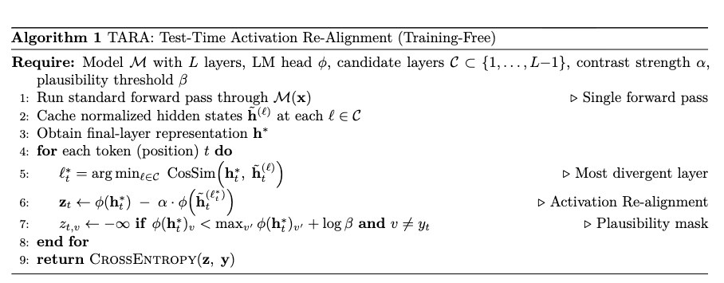

# Novel Test-Time Method TARA Val BPB=0.97 under 4 mins (training-free unlike TTT)

**val_bpb: 0.9693** (5-seed mean, std 0.0016) | **~12 MB** | 8×H100 SXM

## Results

| Seed | Val Loss (Training) | Val BPB (Training) | Val Loss (Post-TARA) | **Val BPB (Post-TARA)** | TARA Gain (BPB) | Train Time | TARA Eval Time |
|------|--------------------|--------------------|----------------------|--------------------------|-----------------|------------|----------------|
| 4 | 2.0875 | 1.2364 | 1.6344 | **0.9680** | −0.2684 | 200.1s | 167.8s         |
| 22 | 2.0880 | 1.2366 | 1.6358 | **0.9688** | −0.2678 | 200.1s | 167.7s         |
| 42 | 2.0882 | 1.2367 | 1.6338 | **0.9677** | −0.2690 | 200.1s | 167.7s         |
| 44 | 2.0828 | 1.2335 | 1.6383 | **0.9703** | −0.2632 | 200.1s | 167.6s         |
| 1337 | 2.0871 | 1.2361 | 1.6404 | **0.9715** | −0.2646 | 200.1s | 167.6s         |
| **Mean** | **2.0867** | **1.2359 (std 0.0013)** | **1.6365** | **0.9693 (std 0.0016)** | **−0.2666** | **~200s** | **~168s**      |

> **TARA Gain** = Val BPB (Post-TARA) − Val BPB (Training), i.e. improvement over the sliding-window eval immediately after training.

## New Method: TARA (Test-Time Activation Re-Alignment)



We introduce **TARA** (Test-Time Activation Re-Alignment) a training-free test-time method that improves predictions by Re-aligning final-layer activations against "premature" activations from earlier hidden states. Unlike TTT in TARA we do **no gradient steps and no weight updates**.
At each token position, the candidate hidden state with the **highest cosine distance** from the final representation is selected as the premature signal. The contrastive adjustment sharpens the final distribution without ever touching model weights.

Unlike Test-Time Training (TTT), TARA:
- Requires **zero gradient steps**
- Has **no risk of overfitting** to the validation split
- Adds only a handful of extra matmuls during test-time per forward pass (~168s total eval overhead)


### TARA Hyperparameters

| Parameter | Value                                            |
|-----------|--------------------------------------------------|
| `alpha` | 0.1 (Re-alignment weight)                        |
| `beta` | 0.2 (plausibility threshold fraction, log-space) |
| Candidate layers | 0, 1, 2, 3 (early encoder layers)                |
| Eval stride | 64 tokens (sliding window)                       |

### Timing Budget

| Phase | Time |
|-------|------|
| Training (wallclock cap) | ~200s |
| TARA eval | ~168s |
| **Total** | **~368s (~6 min)** |

## Training and Architecture Config

9-layer GPT like architecture with GQA, RoPE, and int6+zstd compression:

| Component       | Setting                                          |
|-----------------|--------------------------------------------------|
| Layers          | 9 (512d, 8H, 4KV GQA)                            |
| MLP             | 2.5× relu²                                       |
| Vocab size      | 1,024 (BPE SentencePiece)                        |
| Sequence length | 2,048                                            |
| Batch tokens    | 786,432 (768K)                                   |
| RoPE base       | 50,000                                           |
| Tied embeddings | Yes                                              |
| Training Tokens | ~ 2B                                             |
| Logit soft-cap  | 30.0                                             |
| Quantization    | int6 per-row + zstd-22                           |
| Optimizer       | Muon (matrix params) + Adam (embeddings/scalars) |


## Run Command

```bash
export CUDA_VISIBLE_DEVICES=0,1,2,3,4,5,6,7
RUN_ID=seed1337 \
DATA_PATH=./data/datasets/fineweb10B_sp1024/ \
TOKENIZER_PATH=./data/tokenizers/fineweb_1024_bpe.model \
VOCAB_SIZE=1024 \
SEED=1337 \
torchrun --standalone --nproc_per_node=8 train_gpt.py
```


## Credits

- **TARA method**: This submission developed by Sunny Sanyal @sanyalsunny111
- **Base model architecture**: Adapted from [PR #179](https://github.com/openai/parameter-golf/pull/179) by @devin-cog
