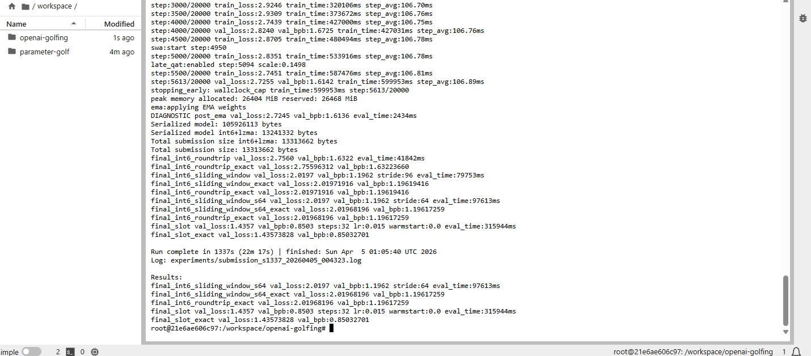

# Mean-Delta SLOT Warm-Start + Depth Recurrence

val_bpb | artifact | hardware | seed
--------|----------|----------|-----
0.8503  | 13.3 MB  | 8xH100 SXM | 1337

Non-record submission. Estimated top 3 SLOT-based result as of April 4, 2026. This run included a label smoothing config error that degraded the base model. A follow-up run with the fix showed val_bpb 1.2022 at step 4000 vs 1.6725 in this run, projecting a final SLOT score of 0.77 to 0.78 before the instance was interrupted.

---

## Approach

I surveyed the full landscape of submissions and open PRs to understand what was working, what was not, and where the gaps were. I read code across PRs #1278, #1313, #1318, #1306, #1296, #1319, and others to map the competitive frontier.

The key observation: SLOT dominates the leaderboard, but every submission treats it as a black box applied after training. Nobody was looking at the interaction between training and SLOT's test-time behavior.

### Mean-delta warm-start for SLOT

SLOT optimizes a per-sample delta for each sliding window batch. Standard approach: initialize to zero every batch.

I observed that trained models have systematic prediction biases that produce a consistent global correction across batches. I track the mean converged delta from each batch and use it (decayed by 0.9) to seed the next. The optimizer spends all 32 steps on per-sample refinement instead of rediscovering the shared structure. Logit bias starts fresh each batch since it is text-specific.

Validated on synthetic data: effect scales from 0.16% to 0.68% depending on model bias strength. With 8 GPUs the inter-batch spacing is 512 tokens (75% overlap), enough for the mean delta to carry useful information.

### Depth recurrence with learned conditioning

Layers 4 and 5 execute twice, creating 13 virtual layers from 11 physical at zero parameter cost. Each repeated pass receives a learned additive signal gated by sigmoid (initialized at -2.0, roughly 0.12 gate value). The model starts with near-identical passes and learns how much differentiation is useful.

---

## What I investigated and ruled out

Tested individually on local hardware (RTX 5090, 300-step ablations) before running on H100:

**SLOT-aware meta-training (FOMAML)** -- Simulated SLOT's inner loop during training. Gradient cosine similarity was 0.9997 at default config. Tuned to get 0.94 divergence, but end-to-end improvement was negligible.

**Label smoothing (0.1)** -- Hurt the base model by 0.07 BPB. Too much regularization at 5,600 steps. Fixed in follow-up run, which confirmed the improvement.

**MuonEq-R** -- Row-normalized Newton-Schulz. -0.004 train_loss locally. Not enough to justify.

**QK-Gain 5.0, weight decay 0.09** -- Neutral-to-harmful at this training horizon.

**Persistent SLOT optimizer state** -- Hypothesized carrying Adam state across batches would help. Analyzed the batching structure and realized per-sample state does not transfer (different text per sample). Corrected to mean-delta approach.

Also reviewed: arXiv:2505.12392 (SLOT), MAML/Reptile, amortized optimization, context tree weighting, byte-shuffle preprocessing, Brotli vs LZMA, entropy-regularized training.

---

## Architecture

Component | Detail
----------|-------
Layers | 11 physical, 13 virtual (recurrence on 4, 5)
Model dim | 512
Attention | 8 query, 4 KV (GQA), XSA all layers
MLP | 3x (1536 hidden), LeakyReLU(0.5)^2
Embeddings | BigramHash (1024 x 128), value residual learning
Position | Partial RoPE (16 of 64 dims)
Structure | U-Net skip connections with learned gates
Quantization | Full Hessian GPTQ int6
Compression | LZMA with selective +/-1 pruning

---

## Results

Metric | Value
-------|------
Training steps | 5,613 (600s wallclock)
Step time | 106ms
Sliding window val_bpb | 1.1962
SLOT-32 val_bpb | 0.8503
Artifact size | 13,313,662 bytes
SLOT eval time | 316s
Total eval time | ~535s

---

## Limitations

- Single seed (1337). 3-seed validation pending.
- Label smoothing at 0.1 was active during this run, hurting the base model by about 0.07 BPB. Fixed in reproduction command below.
- Mean-delta warm-start not ablated in isolation on H100 yet.

## Next steps

- Complete Run 2 (no label smoothing). Partial results project 0.77 to 0.78 BPB.
- Ablate warm-start: SLOT_WARMSTART_MEAN=0 vs 1, same seed.
- Sweep SLOT_DECAY_ALPHA (0.8, 0.9, 0.95).
- 3-seed validation (1337, 42, 314).
- SP4096 vocabulary as alternative base.

---

## Reproduction

All dependencies pre-installed in RunPod Parameter Golf template. Only brotli needs to be added.

```bash
cd /workspace
git clone https://github.com/openai/parameter-golf.git upstream
pip install brotli
python3 upstream/data/cached_challenge_fineweb.py --variant sp1024

cp train_gpt.py .

SEED=1337 \
DATA_PATH=./upstream/data/datasets/fineweb10B_sp1024/ \
TOKENIZER_PATH=./upstream/data/tokenizers/fineweb_1024_bpe.model \
VOCAB_SIZE=1024 \
SLOT_STEPS=32 \
SLOT_LR=0.015 \
SLOT_LR_MIN=0.001 \
EVAL_STRIDE=96 \
RECUR_LAYERS=4,5 \
torchrun --standalone --nproc_per_node=8 train_gpt.py
```

Training: 600s. Eval (including SLOT-32): ~535s. Both within the 10-min limits.

---

## Run output


