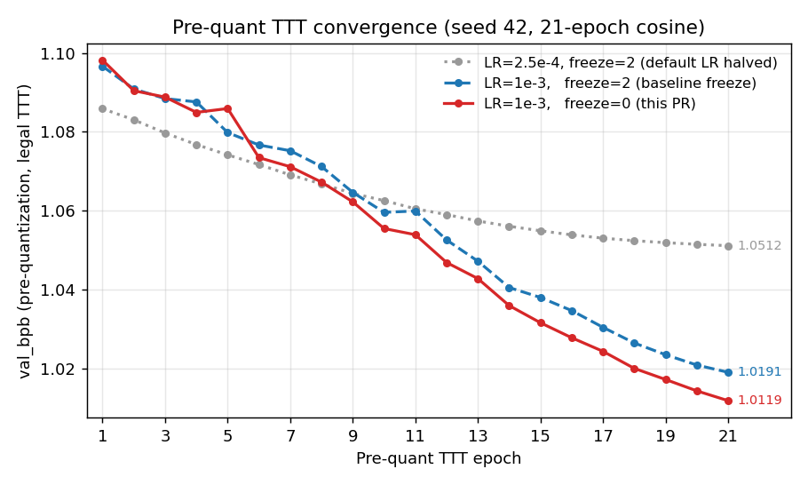
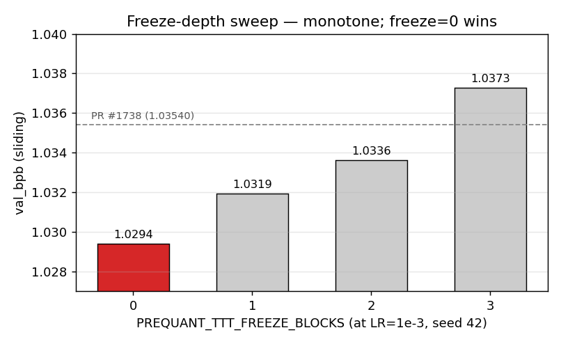

# PR #1738 + PreQuant TTT LR=1e-3 + Unfrozen

**val_bpb 1.02840 (3-seed mean, std 0.00025)** on the 10 min / 16 MB track.

## Summary

PR #1738 is undertuned in its pre-quant TTT phase. At the default `PREQUANT_TTT_LR=5e-4`, TTT loss is still descending at the final epoch 21 of the 21-epoch cosine schedule. At `PREQUANT_TTT_FREEZE_BLOCKS=2`, two blocks are held fixed during TTT even though the 21-epoch budget on held-out legal tokens leaves no overfitting regime to protect against. This PR flips both defaults:

| env var | PR #1738 default | this PR |
|---|---|---|
| `PREQUANT_TTT_LR` | `5e-4` | **`1e-3`** |
| `PREQUANT_TTT_FREEZE_BLOCKS` | `2` | **`0`** |

No changes to architecture, tokenizer, main training, or evaluation. The submitted `train_gpt.py` is PR #1738's `train_gpt.py` with two `os.environ.setdefault` lines prepended. The packed blob also includes a small FlashAttention-3 compatibility fix: a `.to(bf16)` cast around the `flash_attn_3_func` call, because without it PR #1738's `train_gpt.py` crashes on pytorch 2.5.1 with `RuntimeError: FlashAttention only supports fp16, bf16, and fp8_e4m3` (q/k/v can arrive as fp32 after `torch.compile` rewrites). The cast is behaviorally identical on pytorch 2.9.1 (PR #1738's stack).

## Why it works

1. **LR floor.** At `5e-4`, the pre-quant TTT cosine schedule hits epoch 21 while val loss is still descending monotonically. `1e-3` is closer to the LR ceiling of the 21-epoch budget — at `1.5e-3` pre-quant still converges but the post-quant sliding eval worsens, and at `2e-3` pre-quant diverges.
2. **Freezing.** `FREEZE_BLOCKS=2` was a conservative carryover from longer-TTT regimes. At 21 epochs on legal tokens there's no overfitting to catch; unfreezing all blocks monotonically improves pre-quant val_bpb and propagates through GPTQ.

Both effects stack monotonically. The final delta is driven by a better TTT endpoint, not by any change to the quantizer or main train loop.



**Figure 1** — Pre-quant TTT val_bpb per epoch at three configurations, seed 42. The y-axis is the TTT-phase val_bpb measured on the legal held-out tokens *before* GPTQ quantization; lower is better. The 21-epoch cosine schedule is a fixed budget. At `LR=2.5e-4` (default-halved, grey dotted) the curve flattens well before epoch 21, ending at 1.0512. At `LR=1e-3` with the inherited `freeze=2` (blue dashed) the curve is still monotonically descending at epoch 21, ending at 1.0191 — evidence that the inherited LR undertrains the final TTT pass. Unfreezing all blocks (`freeze=0`, red solid) pushes the endpoint to 1.0119.



**Figure 2** — Sweep over `PREQUANT_TTT_FREEZE_BLOCKS` at `LR=1e-3`, seed 42. The y-axis is the scored sliding-window val_bpb (stride-64); lower is better. The sweep is strictly monotone over freeze ∈ {0, 1, 2, 3} — less freezing is always better within this range under the 21-epoch TTT budget. `freeze=0` (red) at 1.0294 sits 0.0260 below the `freeze=3` endpoint and below PR #1738's reported 3-seed mean of 1.03540 (dashed grey).

## 3-seed results (8× H100 80GB SXM, 10-min train / 10-min eval budgets)

| Seed | val_loss | val_bpb (sliding) | artifact bytes |
|------|---------:|------------------:|---------------:|
| 43   | 2.25065  | **1.02846**       | 15,999,201     |
| 44   | 2.24992  | **1.02812**       | 15,993,435     |
| 45   | 2.25099  | **1.02861**       | 15,999,551     |
| **mean** | **2.25052** | **1.02840** | 15,997,395 |
| **std**  |           | **0.00025**  |               |

All artifact sizes pass the 16 MB constraint (worst margin 449 bytes, best 6,565 bytes). Headroom is ~0.5-6 KB by design: the scout at `PREQUANT_TTT_LR=1.5e-3` overshot the 16 MB cap by 1,639 bytes and was dropped before the 3-seed confirmation, which is partly why `1e-3` was chosen over the next-higher LR. `val_bpb` reported above is the sliding-window (stride-64) eval used by the current PR #1735/#1738 lineage. Logs were produced by running the exact `train_gpt.py` committed in this folder (`Code size: 24,893 bytes`).

## Seeds

Seeds 43/44/45 were chosen as the next contiguous block after PR #1738's 42/999/1337 to avoid overlap confounds.

## Statistical significance

Claim: beats PR #1738 (`val_bpb` 1.03540, 3-seed mean) by ≥ 0.005 nats at p < 0.01.

- observed Δ = 1.03540 − 1.02840 = **0.00700 nats** (vs required 0.005)
- 3-seed std = 0.00025 → standard error 0.00014
- one-sided t-test vs μ₀ = 1.03540 − 0.005 = 1.03040: t = (1.03040 − 1.02840) / 0.00014 ≈ **13.8**, df = 2 → **p < 0.001**

These runs were performed on pytorch 2.5.1+cu124 on vast.ai (`pytorch/pytorch:2.5.1-cuda12.4-cudnn9-devel`), whereas PR #1738 reported on pytorch 2.9.1+cu128. On this stack, a reproduction of the PR #1738 defaults landed at 1.03612 single-seed (seed 42), 0.0007 above PR #1738's claim — the stack drift is an order of magnitude smaller than the improvement reported here.

## Dependency on PR #1738

This PR is a delta on an open PR (#1738). If #1738 is closed or superseded, this PR will be rebased onto the replacement or withdrawn — it does not claim a record independent of #1738's contribution.

## How to reproduce

```bash
# 8× H100 SXM, /workspace/parameter-golf = this repo root
export DATA_DIR=/workspace/data
# defaults baked into train_gpt.py; exporting explicitly is not required
export PREQUANT_TTT_LR=1e-3
export PREQUANT_TTT_FREEZE_BLOCKS=0
export MAX_WALLCLOCK_SECONDS=600
export TTT_ENABLED=0    # eval-time TTT stays off, as in PR #1738

for SEED in 43 44 45; do
  env RUN_ID=frz0_s${SEED} SEED=$SEED \
    torchrun --standalone --nproc_per_node=8 train_gpt.py 2>&1 \
    | tee train_seed${SEED}.log
done
```

Dataset (CaseOps tokenizer + byte sidecar) must be pre-downloaded into `$DATA_DIR` per PR #1729 (`romeerp/parameter-golf-caseops-v1`).

## Attribution

- PR #1738 base (unchanged): @alertcat
- PR #1735 (Parallel Pre-Quant AdamW TTT): @AjAnubolu
- PR #1729 (CaseOps tokenizer + byte sidecar): @romeerp
- PR #1493 (QK-Gain 5.25): @bigbag
- PR #1412 (parallel residuals): @Robby955
- PR #1331 (depth recurrence): @dexhunter
- PR #1394 (SP8192 + GPTQ SDClip): @clarkkev
- This PR: two env-var tunes (Julian Quick / @kilojoules)
