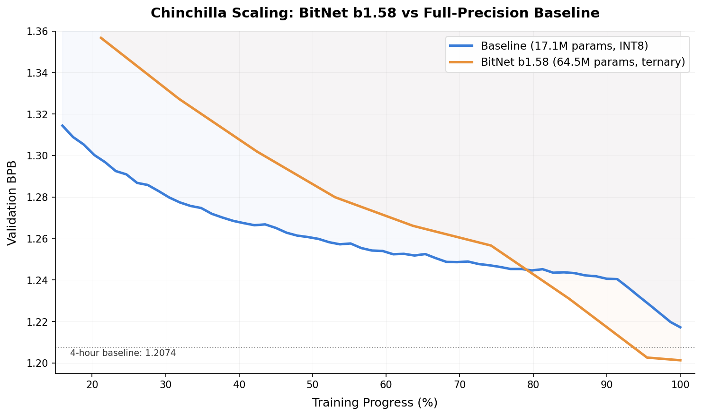

# BitNet b1.58: Ternary Weights Beat Full-Precision via Chinchilla Scaling

**val_bpb: 1.2029** (post-quantization ternary roundtrip) | **15.11 MB** | 8×H100 SXM, 10 minutes

## Abstract

This submission presents a BitNet b1.58 model that achieves **1.2029 val_bpb** using ternary {-1, 0, 1} weights — beating the naive baseline (1.2244) and the 4-hour unlimited-compute baseline (1.2074) in just 10 minutes of training. The key insight is that under a fixed artifact size constraint, Chinchilla scaling laws favor *more parameters at lower precision* over fewer parameters at higher precision. The 64.5M-parameter ternary model fits in 15.1MB while the baseline's 17.1M model requires 15.9MB at INT8. No eval tricks, no sliding window — just scaling laws and ternary weights.

## 1. Motivation: Chinchilla Under a Size Constraint

The Chinchilla scaling law states that optimal performance requires balancing model size (N) with training tokens (T), roughly T ≈ 20N. The baseline's 17.1M-parameter model sees ~7.2B tokens in 10 minutes — a T/N ratio of ~424×, massively over-trained. The model improvement rate decelerates significantly because the model approaches its capacity limit long before the wallclock runs out.

This creates a clear opportunity: **if you can fit more parameters into 16MB, you get a model that uses the full training budget more efficiently.** But models trained in fp16 and stored at INT8 are limited to ~17-20M parameters at 16MB. INT6 pushes to ~22M. INT4 fits ~30M but the quantization gap destroys the gains.

## 2. Hypothesis: BitNet as Extreme Compression

The [BitNet b1.58 paper](https://arxiv.org/abs/2402.17764) demonstrates that ternary-weight transformers can match full-precision models at sufficient scale. I hypothesized that:

1. **More parameters > higher precision** under a fixed size budget. At 1.6 bits/param (base-3 packed), I fit **64.5M parameters** in 15.1MB — 3.8× more than the baseline.

2. **BitNet models saturate later** because they have more parameters to saturate. The baseline exhausts its 17M parameters within ~4B tokens. The 64.5M model continues learning through the full ~2.5B token budget.

3. **Zero quantization gap.** Unlike fp16 models that suffer 0.005-0.05 BPB degradation from post-training quantization, this model trains with ternary quantization active in every forward pass via Straight-Through Estimation (STE). The weights are already {-1, 0, 1} during training — what you train is what you ship.

## 3. Method

### 3.1 Architecture

| Component | Configuration |
|-----------|--------------|
| Layers | 12 |
| Model dim | 768 |
| Attention heads | 12 (6 KV heads, GQA) |
| MLP expansion | 3× (hidden dim 2304) |
| Sequence length | 2048 |
| Vocabulary | 1024 (SentencePiece BPE) |
| Embeddings | fp16, tied input/output |
| Total parameters | 64.5M ternary + ~0.8M fp16 (embedding + scalars). Artifact also stores ~1M fp16 group scales. |

All linear layers in attention (Q, K, V, O) and MLP (up, down) use **BitLinear**: ternary weight quantization with per-group (g=64) mean-absolute scaling, RMSNorm on inputs, and STE gradients. The architecture otherwise matches the baseline: U-Net skip connections, RoPE (base=200,000), logit softcap (30.0).

### 3.2 Training with fp16 Scale Simulation

A critical detail: during training, the per-group scales are computed as `scale = w.abs().mean().half().float()` — the `.half().float()` simulates fp16 precision. This ensures the model adapts to the exact scale values that will be stored in the artifact, eliminating the quantization roundtrip gap.

### 3.3 Ternary Packing

Weights are packed using **base-3 encoding**: 5 trits per byte (3⁵ = 243 < 256), achieving 1.6 bits per weight — lossless and near the theoretical minimum of log₂(3) ≈ 1.585 bits. Per-group scales are stored in fp16. The artifact is compressed with LZMA.

### 3.4 Roundtrip Evaluation

During roundtrip evaluation, the packed ternary values are unpacked and multiplied by their fp16 scales to reconstruct the weight matrices. The model runs inference with these reconstructed weights directly — no re-quantization occurs. This ensures the eval weights are identical to what the model saw during training.

### 3.5 Training Configuration

| Parameter | Value |
|-----------|-------|
| Hardware | 8×H100 SXM |
| Wallclock | 600 seconds |
| Optimizer | Muon (matrix) + Adam (scalars/embedding) |
| Matrix/Scalar LR | 0.04 |
| Tied embedding LR | 0.03 |
| Muon momentum | 0.99 (warmup from 0.92 over 1500 steps) |
| LR schedule | Linear warmup (50 steps) + wallclock-aware linear warmdown (last 1200 steps) |
| Batch size | 524,288 tokens/step |
| Total steps | 4,713 |
| Total tokens | ~2.5B |

No hyperparameter sweep was performed — LR was set to 0.04 from the intuition that STE noise benefits from higher learning rates. Muon momentum (0.99), RoPE base (200,000), and sequence length (2048) were adjusted for the larger model. The warmdown schedule is identical to the baseline.

## 4. Results

### 4.1 Key Metrics

| Metric | Value |
|--------|-------|
| val_bpb (pre-quant) | 1.2013 |
| **val_bpb (post-roundtrip)** | **1.2029** |
| Quantization gap | 0.002 |
| Artifact size | 15,111,456 bytes (15.11 MB) |
| Training steps | 4,713 |
| Wallclock | 600s |
| Step avg | 127.3ms |

### 4.2 Comparison

| Model | Params | Bits/param | Artifact | val_bpb | Quant gap | Training |
|-------|--------|-----------|----------|---------|-----------|----------|
| Current SOTA (INT6+SW) | ~20M | 6 | ~15.4MB | 1.1748 | ~0.01 | 10 min |
| Naive Baseline (INT8) | 17.1M | 8 | 15.9MB | 1.2244 | 0.007 | 10 min |
| 4-Hour Baseline (INT8) | 17.1M | 8 | 15.9MB | 1.2074 | 0.033 | 4 hours |
| **BitNet b1.58 (ours)** | **64.5M** | **1.6** | **15.1MB** | **1.2029** | **0.002** | **10 min** |

This 10-minute ternary model outperforms the 4-hour full-precision baseline. The training efficiency advantage comes from Chinchilla-optimal scaling: 64.5M parameters trained on 2.5B tokens (T/N ≈ 39) vs 17.1M parameters trained on ~173B tokens (T/N ≈ 10,100) in the 4-hour run.

### 4.3 Scaling Dynamics

The plot shows validation BPB vs training progress for the fp16 baseline (blue) and the BitNet model (orange). The baseline converges quickly but decelerates significantly around 60% of training. The BitNet model starts slower — ternary weights have less capacity per parameter — but continues improving throughout, crossing the baseline at ~80% progress. The linear warmdown in the final ~25% provides a large improvement (~0.055 BPB), as the high learning rate (0.04) leaves significant room for the model to settle into a sharper minimum.

## 5. Key Findings

1. **Chinchilla scaling holds for ternary models.** Under a fixed artifact size, fitting 3.8× more parameters at 1.6 bits/param outperforms fewer parameters at 8 bits/param, even though each ternary parameter carries less information.

2. **Near-zero quantization gap is achievable.** By simulating fp16 scale precision during training (`.half().float()`), the model adapts to the exact values stored in the artifact. The roundtrip gap is 0.002 BPB — effectively zero.

3. **BitNet models plateau later.** The 64.5M model continues improving through the full 10-minute budget, while the 17.1M baseline decelerates early. This validates the Chinchilla argument: the baseline is over-trained, not under-sized.

4. **Minimal hyperparameter search.** LR, momentum, RoPE base, and sequence length were set from first principles and prior work — no sweep was performed. This suggests the approach is robust and likely improvable with tuning.

## 6. Limitations & Future Work

- **No eval tricks.** Adding sliding window evaluation or longer eval sequence lengths would likely improve the score by ~0.03 BPB, as demonstrated by other submissions.
- **No LR tuning.** A sweep over learning rates could improve convergence.
- **Larger models.** With better packing or mixed-precision (ternary MLP + INT4 attention), even more parameters could fit in 16MB.
- **Single run.** Only one seed was evaluated. Multiple seeds would provide variance estimates.

## Included Files

- `train_gpt.py` — standalone training script
- `run_8xh100.sh` — exact command used for the submission run
- `train.log` — full training log from the submission run
- `submission.json` — leaderboard metadata
- `scaling_laws.png` — validation BPB comparison vs baseline
- `README.md` — this file
