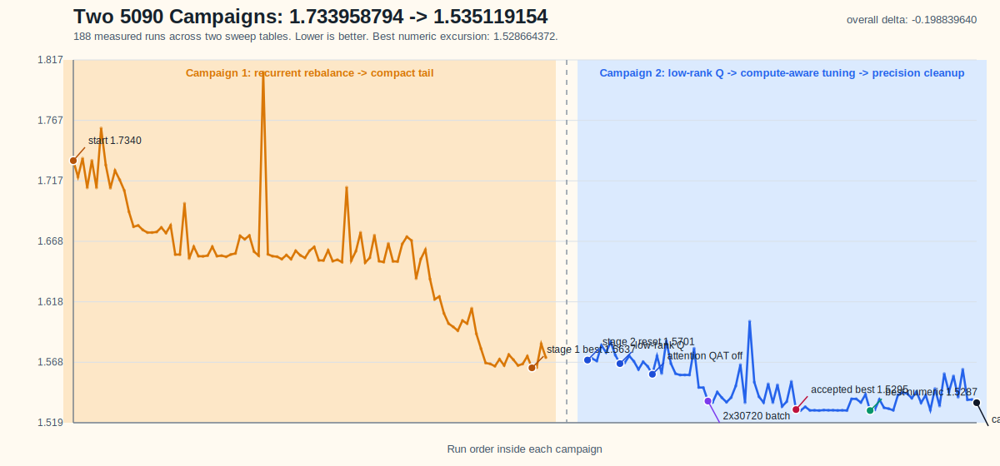
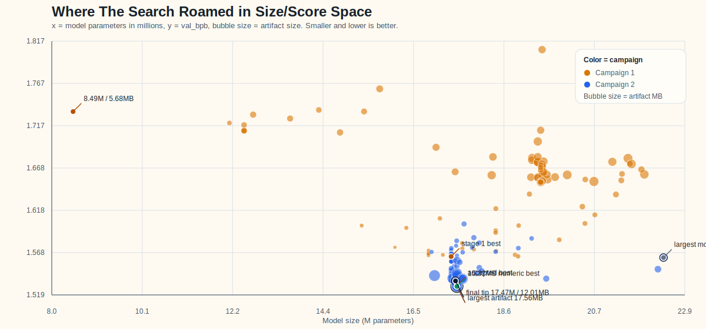

# Non-Record Submission: Two 5090 Autoresearch Campaigns

This submission documents a git-native autoresearch loop on a single RTX 5090. The repo runs one fixed-budget experiment, commits the code change, keeps real wins, reverts losers, and uses the git history itself as search memory.

Across two sweep tables and 188 measured runs with `val_bpb`, the search moved from **1.733958794** on the first baseline to **1.535119154** at the end of the second campaign, with a best numeric excursion to **1.528664372**.

The packaged `train_gpt.py` snapshot is the stable accepted-best branch point from commit `905cc4d` / run `ar5090-20260321-231130`:

- `val_bpb`: **1.529478563**
- artifact size: **9,190,936 bytes**
- params: **17.500192M**
- wallclock: **427.855572 s**

The README focuses on the larger search story because that is the real contribution here: many committed ideas, many reverted ideas, and a clear model-design trajectory rather than a single isolated run.

## Campaign At A Glance

| Campaign | Start | Best | End | Main shifts |
|----------|-------|------|-----|-------------|
| Campaign 1 | `1.733958794` | `1.563742695` | `1.572203327` | rebalance recurrence, move capacity into unique tail blocks, compact the model, spend bytes on wider tail MLPs |
| Campaign 2 | `1.570137665` | `1.528664372` | `1.535119154` | low-rank `q_proj`, short-to-full context warmup, attention-QAT-off, smaller update batches, targeted precision spends |

Overall headline:

- start to end: `1.733958794 -> 1.535119154` (`-0.198839640`)
- start to best numeric run: `1.733958794 -> 1.528664372` (`-0.205294422`)
- model size arc: `8.485920M params / 5.679745 MB artifact -> 17.467168M params / 12.007446 MB artifact`
- search envelope: up to `22.351912M` params and `17.560314 MB` artifacts, which was useful to explore but not the final answer

## Visual Summary

Full score trajectory across both campaigns:

Where the search wandered in size/score space:

## What The Git History Actually Tried

The interesting part of this repo is not “make the model bigger.” The committed search history shows a more specific progression.

### 1. Stop Repeating The Carrier

The early wins came from reducing repeated/shared compute and spending that budget on unique late blocks. The search moved from the starting recurrent layout toward a compact carrier plus deeper unique tail, and that alone pulled the score from `1.733958794` down into the low `1.67x` range.

### 2. Spend Bytes On Unique Tail Capacity

The next wave of wins came from turning the model into a stemless or nearly stemless compact line and using MLP-only int6 export to reclaim artifact budget. That reclaimed room was repeatedly spent on stronger tail MLPs. The winning direction was not more depth forever. It was fewer repeated blocks and fatter useful tail blocks.

### 3. Use Low-Rank Q To Buy Compute

Campaign 2 is where the repo started acting less like architecture roulette and more like a disciplined compute allocator. The biggest improvements came from:

- low-rank `q_proj` on most blocks
- short-to-full context warmup
- disabling attention fake quant during training
- shrinking the global update shape from `4 x 30720` to `3 x 30720` and then `2 x 30720`
- delaying MLP fake quant until the full-context boundary

That sequence is what drove the second campaign from `1.570137665` down through the `1.53x` band.

### 4. Spend Precision Like It Hurts

The late-stage precision lesson was very consistent: broad float bundles usually lost, but narrow targeted precision spends could help.

What worked:

- restore full-rank `q_proj` only on the final tail block
- keep tied embeddings in fp16 export on that line

What usually lost:

- shared full-rank Q
- broad attention float bundles
- shared plus final-tail float bundles
- near-cap precision stacks that looked expensive but did not move the score enough

## Things That Mostly Lost Anyway

The git history is full of committed negative results, which is part of why this repo is useful to read. The recurring losers were:

- blunt `d_model` increases
- removing recurrence entirely
- clean global `mlp_mult=3` conversions
- `seq_len=960` or `1024` on this fixed 5090 budget
- `num_kv_heads=8`
- broad precision relaxations instead of targeted ones

In other words, the search kept rediscovering the same lesson: under a tight wallclock budget, compute allocation mattered more than making every component richer.

## What Is Included

- `train_gpt.py`
  the packaged accepted-best training script from commit `905cc4d`, adjusted only so it runs from this records folder and counts `train_gpt.py` in artifact bytes
- `submission.json`
  metadata for that packaged accepted-best snapshot
- `results_stage1.tsv`
  the first sweep table, including the baseline at `1.733958794`
- `results_stage2.tsv`
  the second sweep table, ending at `1.535119154`
- `campaign_val_bpb.svg`
  chart generated from both sweep tables
- `size_vs_score.svg`
  size/score chart generated from both sweep tables

Raw per-run stdout logs were not preserved in this clone. The reliable search record here is the pair of structured sweep tables plus the commit history and notes in the source repo.

Source repo:

- <https://github.com/jadechip/autoresearch-parameter-golf>
