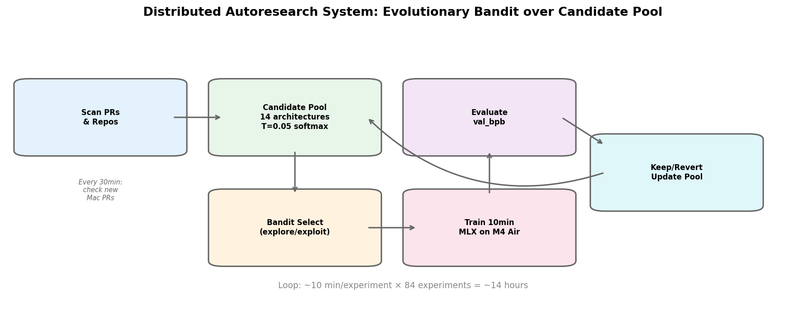
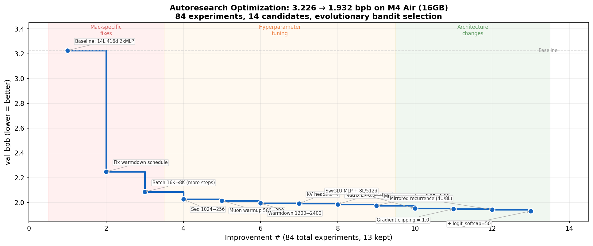
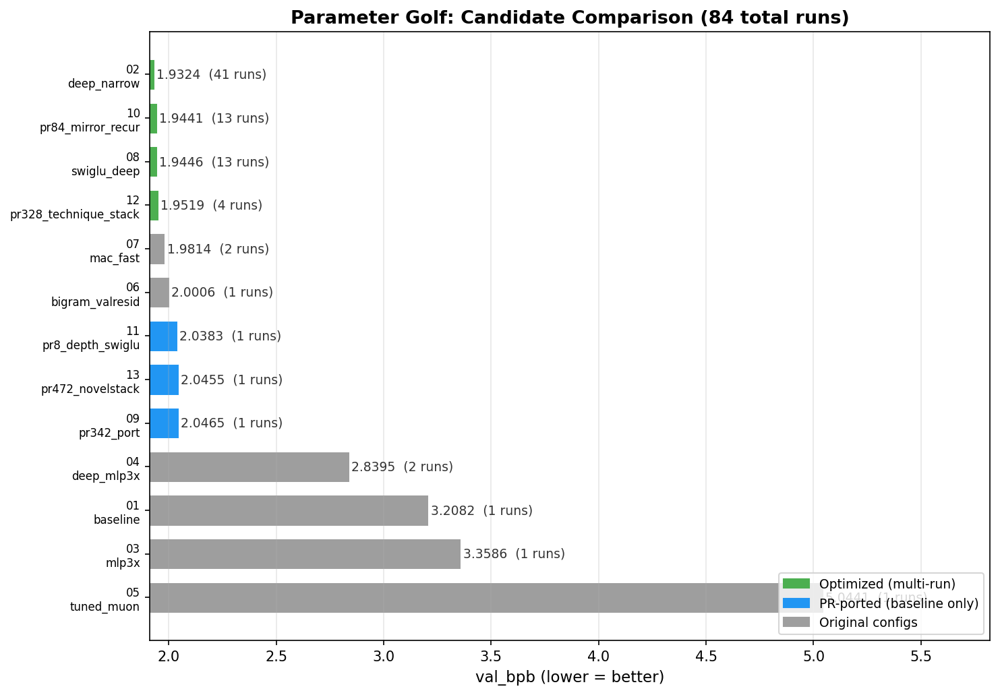
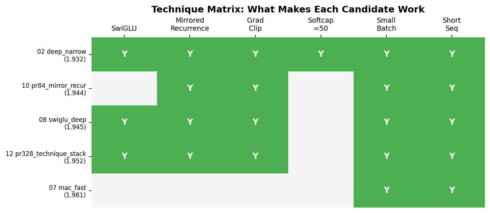

# Non-record: Distributed Autoresearch on M4 Air — Evolutionary Bandit over Candidate Pool (val_bpb=1.9263)

## Summary

Taking parameter-golf to its most constrained extreme — **10 minutes on an M4 Mac Air (16GB)**, the most memory-limited Apple Silicon — with the key vision of testing a new **distributed paradigm in learning**.

This is an attempt at **collective + distributed learning via autoresearch + a frontier of candidates**, which are selected and trained via a bandit optimizing exploration-exploitation. We start by selecting baselines + scanning for other top candidates to get an initial candidate pool, then start autoresearch along this frontier. Every ~30 minutes we scan for new best candidate submissions related to our config and add them to our pool if they are close to or better than our best performers. There is scope for the improved candidates to be shared back to other users, creating a **distributed iterative improvement ecosystem**. Best improved candidate configs from my run have been shared in this PR too, these can be used as seeds by others / future runs.

**84 experiments. 14 candidates. ~14 hours. 3.226 → 1.926 bpb.**

**Full eval val_bpb = 1.9263** — best score on M4 Air (16GB) that we're aware of.

## System Architecture

The system runs an evolutionary bandit loop:
1. **Scan**: Periodically check for new Mac-relevant PRs and add them as candidates
2. **Select**: Bandit balances exploiting top performers vs exploring new candidates. Uninitialized candidates get 60% priority for fast baselining.
3. **Train**: 10 min on M4 Air (MLX), single-process to fit 16GB
4. **Evaluate**: val_bpb on a subset of FineWeb validation set for iteration throughput. 
5. **Update**: Keep improvement, revert regression, update selection probabilities

## Best Candidate: `02_deep_narrow`

**8 logical layers / 4 unique blocks (mirrored recurrence), 512d, SwiGLU MLP**

Started as a 14L 416d baseline (3.226 bpb), optimized to **1.926 bpb** over 41 experiments.

### Key Hyperparameters

| Parameter | Baseline | Optimized | Impact |
|-----------|----------|-----------|--------|
| Architecture | 14L 416d relu² | 8L/4U 512d SwiGLU mirrored | Efficient depth via weight sharing |
| `train_batch_tokens` | 524,288 | 8,192 | Far more training steps in wallclock budget |
| `train_seq_len` | 1024 | 256 | Faster attention, more steps |
| `warmdown_iters` | 100 | 3,200 | Proper LR schedule (was decaying from step 1) |
| `logit_softcap` | 30 | 50 | Less aggressive logit clamping |
| `grad_clip_norm` | 0 | 1.0 | Training stability with SwiGLU |
| `muon_momentum` | 0.95 | 0.90 | Better for small-batch regime |
| `matrix_lr` | 0.04 | 0.05 | Faster convergence |
| `tied_embed_lr` | 0.05 | 0.06 | Faster embedding learning |

### Architectural Changes

- **SwiGLU MLP**: Replaced relu² with gated SiLU (`proj(silu(gate(x)) * fc(x))`). Consistently ~0.01-0.02 bpb better across all candidates.
- **Mirrored Recurrence**: 4 unique transformer blocks reused across 8 logical layers (encoder forward, decoder reverse with U-Net skip connections). Halves parameter count while maintaining effective depth, allowing more training steps within the wallclock budget.
- **Memory management**: `mx.set_cache_limit(2GB)`, `mx.clear_cache()` after optimizer steps, reduced val_batch_size — critical for 16GB M4 Air.

## Optimization Journey

*Scores shown are from partial validation used during iteration for speed. Full eval: val_bpb=1.9263.*

Three distinct phases emerged:
1. **Mac-specific fixes** (3.226 → 2.087): The baseline was configured for H100s. Fixing warmdown schedule and reducing batch size to fit more training steps in the wallclock budget gave the biggest single improvements.
2. **Hyperparameter tuning** (2.087 → 1.976): Systematic tuning of LR, momentum, sequence length, warmdown. Diminishing returns.
3. **Architecture changes** (1.976 → 1.932): SwiGLU, mirrored recurrence, and gradient clipping broke through the hyperparam plateau.

## All Candidates

*Scores from partial validation used during iteration for speed.*

| Rank | Candidate | val_bpb | Runs | Source |
|------|-----------|---------|------|--------|
| 1 | 02_deep_narrow | **1.932** | 41 | Evolved from baseline |
| 2 | 10_pr84_mirror_recur | 1.944 | 13 | Ported from [PR #84](https://github.com/openai/parameter-golf/pull/84) |
| 3 | 08_swiglu_deep | 1.945 | 13 | Custom SwiGLU config |
| 4 | 12_pr328_technique_stack | 1.952 | 4 | Ported from [PR #328](https://github.com/openai/parameter-golf/pull/328) |
| 5 | 07_mac_fast | 1.981 | 2 | Mac-speed optimized |

## Technique Matrix

The winner is the only candidate combining **all** winning techniques. Cross-pollination between candidates was key — SwiGLU was discovered on 08, mirrored recurrence on 10, then combined on 02.

## What Worked (ranked by impact)

1. **Smaller batches = more steps** — The single biggest insight for Mac. H100 baselines use 524K token batches; on Mac, 8K tokens fits far more training steps in the wallclock budget.
2. **Warmdown schedule fix** — The default warmdown_iters=100 caused LR decay from step 1. Setting it proportionally higher keeps LR high throughout training.
3. **SwiGLU activation** — Consistent improvement over relu² across all configs.
4. **Mirrored recurrence** — Weight sharing gives effective depth without the per-step cost.
5. **Gradient clipping** — Essential for stable SwiGLU training.

## What Didn't Work

- Deeper models (>10 layers) — too slow per step on Mac
- Very small batches (4096) — gradient noise outweighs step count benefit
- High learning rates (matrix_lr > 0.06) — training instability
- BigramHash / ValueResidual — added complexity without clear bpb gain on Mac
- MoD-lite routing — MLX scatter VJP not supported

## Hardware

- Apple M4 Air, 16GB unified memory
- MLX 0.31.1
- ~10 min per experiment, 84 experiments over ~14 hours

## Acknowledgments

Initial candidates ported from:
- [PR #84](https://github.com/openai/parameter-golf/pull/84) (mirrored recurrence) — key architectural insight
- [PR #342](https://github.com/openai/parameter-golf/pull/342) (SmearGate + BigramHash on MLX)
- [PR #328](https://github.com/openai/parameter-golf/pull/328) (technique stack + overtone init)
- [PR #472](https://github.com/openai/parameter-golf/pull/472) (NovelStack + TriShift mixer)
- [PR #133](https://github.com/openai/parameter-golf/pull/133) (heavy parameter sharing)
- [PR #8](https://github.com/openai/parameter-golf/pull/8) (depth recurrence + SwiGLU)
- [trevin-creator/autoresearch-mlx](https://github.com/trevin-creator/autoresearch-mlx) — Mac optimization reference
- [karpathy/autoresearch](https://github.com/karpathy/autoresearch) — autoresearch framework inspiration