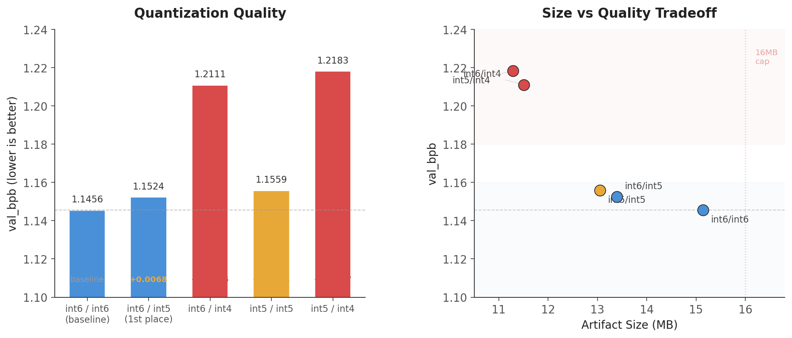

# MoE Exploration + Multi-bit Quantization Analysis

**Author:** Yeseong Lim ([@imyesung](https://github.com/imyesung))
**Track:** Non-record (analysis / negative result)
**Best val_bpb:** 1.1456 (int6 baseline, not a new record)

## Summary

Two experiments testing whether Mixture of Experts (MoE) can beat dense models under the 16MB constraint:

1. **MoE soft routing** (2 experts x 1.5x MLP, same total params as dense 3x MLP) — failed, ~0.06-0.08 BPB worse than dense
2. **Multi-bit quantization comparison** (int4/int5/int6 on the same trained dense model) — int4 is destructive, closing the MoE parameter expansion path

Both are negative results that provide useful data for the community.

## Experiment 1: MoE at Small Scale

**Setup:** 2nd-place architecture (9L, 512dim, MLP3x, SmearGate, BigramHash) with dense MLP replaced by MoE (2 experts x 1.5x, soft gated routing). Total params identical (~22M).

**Result:** Extrapolated final BPB ~1.20-1.22 vs dense 1.1458. MoE lost by ~0.06-0.08 BPB.

**Why it failed:**
- Soft routing = weighted sum of both experts = effectively one slightly flexible MLP
- Per-token MLP capacity halved (1.5x vs 3x) with no compensating specialization
- Apple scaling laws (ICML 2025) show optimal sparsity = 0 below ~500M total params
- 2 experts is too coarse for meaningful specialization (DeepSeekMoE: 16-64 experts needed)

**Could hard routing fix it?** Unlikely at this scale. Hard routing would enable true specialization, but:
- DDP + torch.compile breaks with dynamic routing masks
- Even with hard routing, per-token capacity is still halved
- MoE only wins when total params >> active params, which requires aggressive quantization (see below)

## Experiment 2: Multi-bit Quantization Comparison

**Setup:** Dense 9L MLP3x model trained on 8xH100 SXM (7410 steps, 81ms/step, SWA 30 checkpoints). Same model quantized at 5 different configurations, each with full zstd-22 compression and sliding-window evaluation (stride=64).

| Config | Attn | MLP | Artifact | val_bpb | vs int6 baseline |
|--------|------|-----|----------|---------|-----------------|
| attn6_mlp6 | int6 | int6 | 15.14 MB | 1.1456 | baseline |
| attn6_mlp5 | int6 | int5 | 13.39 MB | 1.1524 | +0.0068 |
| attn6_mlp4 | int6 | int4 | 11.51 MB | 1.2111 | **+0.0655** |
| attn5_mlp5 | int5 | int5 | 13.05 MB | 1.1559 | +0.0103 |
| attn5_mlp4 | int5 | int4 | 11.29 MB | 1.2183 | +0.0727 |



**Key findings:**

- **int5 MLP is viable** (+0.007 BPB, saves 1.75 MB) — consistent with the current 1st place using int5 for MLP
- **int4 MLP is destructive** (+0.065 BPB) — wipes out 80% of all gains from baseline to 1st place
- **int5 attention adds ~+0.004 BPB** over int6 attention — attention is more sensitive to quantization than MLP
- **int4 is not viable anywhere** — both MLP and attention show catastrophic degradation

## Why This Matters for MoE

The MoE value proposition under 16MB is: "use aggressive quantization to fit more total expert parameters, compensate per-token capacity loss with specialization."

This data shows:
- int5 saves only 1.75 MB (~12% of MLP budget) — not enough for meaningful expert expansion
- int4 saves 3.63 MB but costs +0.065 BPB — far exceeds any plausible specialization gain
- The quantization headroom for MoE simply doesn't exist at this scale

## Architecture

Same as 2nd-place submission with MoE additions:
- 9 layers, 512 dim, 8 heads, 4 KV heads (GQA)
- MLP: ReLU^2, 3x expansion (dense) or 2 experts x 1.5x (MoE)
- SmearGate + BigramHash(4096)
- Muon optimizer (matrix) + AdamW (embeddings/scalars)
- SWA, weight decay 0.04

## Reproducibility

```bash
# Dense quantization comparison (8xH100 SXM, ~10min training + ~13min eval)
cd /workspace/parameter-golf
NCCL_IB_DISABLE=1 NUM_EXPERTS=1 MLP_MULT=3 NUM_LAYERS=9 MODEL_DIM=512 \
TRAIN_SEQ_LEN=2048 MAX_WALLCLOCK_SECONDS=600 RUN_ID=quant_comparison \
torchrun --standalone --nproc_per_node=8 train_gpt.py

# MoE run (8xH100 SXM)
NCCL_IB_DISABLE=1 NUM_EXPERTS=2 MLP_MULT=1.5 \
torchrun --standalone --nproc_per_node=8 train_gpt.py
```

## References

- Abnar et al., "Parameters vs FLOPs: Scaling Laws for Optimal Sparsity for Mixture-of-Experts Language Models", ICML 2025
- Dai et al., "DeepSeekMoE: Towards Ultimate Expert Specialization", ACL 2024
- Kim et al., "MoQE: Mixture of Quantized Experts", 2023
