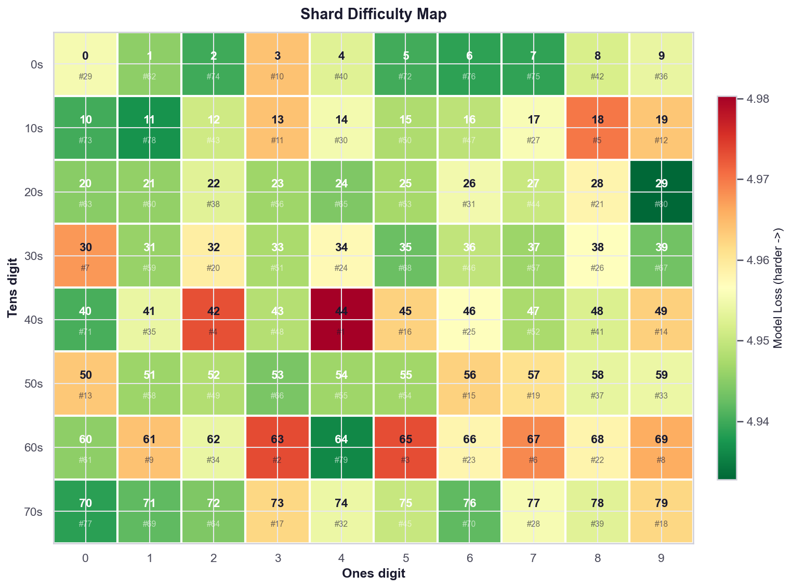
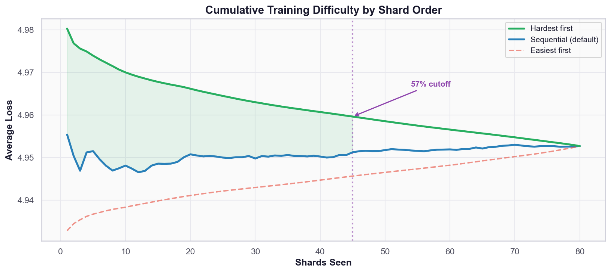
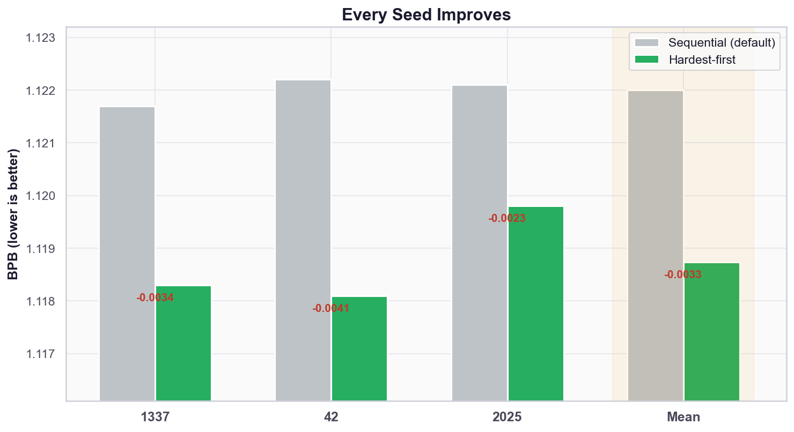
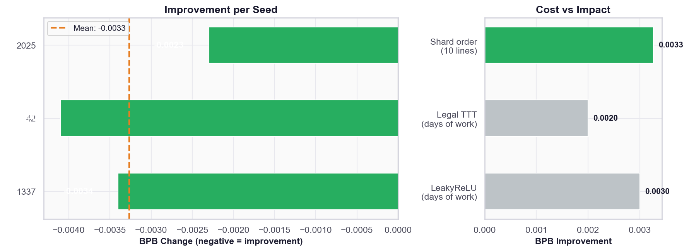

# You're Training on 57% of Your Data. Does It Matter Which 57%?

**Non-record submission: a case study on training data ordering.**

Everyone in this competition trains sequentially through the shards. Nobody questions the order. We did — and found a free **-0.0033 BPB** improvement by reordering shards based on model perplexity. Zero architecture changes, zero hyperparameter tuning, ten lines of code.

## The Setup

At 83ms/step we get ~7,200 steps in 600s. That's 5.66B tokens out of 10B — **57% of the dataset**. Shards 0 through ~45 get seen. Shards 46-79 never do.

## Token Statistics Say It Doesn't Matter

We computed KL(val || shard) for all 80 training shards. Every shard has essentially the same token distribution. Range: 0.0009. Translates to ~0.00005 BPB. Dead end.


Left panel. All shards look identical by token frequency.

## The Model Disagrees

Trained a model 500 steps on one shard, then scored all 80 shards by cross-entropy loss. Right panel above. Range: **0.0475** — 100× larger than the KL signal. The shards are NOT all the same. Token statistics just can't see the difference.

As expected — KL counts tokens, the model scores sequences. But the magnitude of the gap is what matters: the model finds **100× more variation** than token statistics do.


**r = -0.056.** The two metrics are uncorrelated. The shard most similar to val by token frequency is middling by model difficulty.

## Where the Hard Shards Are

The difficulty is about content, not position. Hard and easy shards are scattered randomly across the dataset.



Shard 44 (hardest, rank #1) sits next to shard 43 (rank #48). Sequential ordering — the default in every training framework — isn't optimized for anything except simplicity.



## Results: 3-Seed Validated

Reran our merged #1 submission (PR #549) with shards reordered hardest-first. Same code, same hyperparameters, same compute budget.

| Seed | Sequential (PR #549) | Hardest-first | Delta |
|------|---------------------|--------------|-------|
| 1337 | 1.1217 | **1.1183** | **-0.0034** |
| 42 | 1.1222 | **1.1181** | **-0.0041** |
| 2025 | 1.1221 | **1.1198** | **-0.0023** |
| **Mean** | **1.1220** | **1.1187** | **-0.0033** |

Every seed improves. Mean improvement: **-0.0033 BPB.**





For context: our last three PRs each took days of architecture and quantization work to gain 0.001-0.003 BPB. This took ten lines of code.

## The Change

```python
class TokenStream:
    def __init__(self, pattern: str):
        self.files = [Path(p) for p in sorted(glob.glob(pattern))]
        # NEW: reorder shards by model difficulty (hardest first)
        shard_order = os.environ.get("SHARD_ORDER", "")
        if shard_order:
            order = [int(x) for x in shard_order.split(",")]
            reordered = [self.files[i] for i in order if i < len(self.files)]
            remaining = [f for i, f in enumerate(self.files) if i not in set(order)]
            self.files = reordered + remaining
```

```bash
SHARD_ORDER=44,63,65,42,18,67,30,69,61,3,13,19,50,49,56,45,73,79,57,32,\
28,68,66,34,46,38,17,77,0,14,26,74,59,62,41,9,58,22,78,4,48,8,12,27,75,\
36,16,43,52,15,33,47,25,55,54,23,37,51,31,21,60,1,20,72,24,53,39,35,71,\
76,40,5,10,2,7,6,70,11,64,29
```

## Method: How We Ranked Shards

1. Train a 6-layer, 512d model for 500 steps on shard 0 (single GPU, ~40 seconds)
2. Score all 80 shards by cross-entropy loss with this partially-trained model
3. Sort shards by loss descending (hardest first)
4. Pass the ordering via `SHARD_ORDER` environment variable

The ranking model is deliberately small and undertrained — it captures which shards have patterns the model hasn't learned yet. A fully-trained model would rank differently (everything is "easy" by then).

## Open Questions

- **Adaptive curriculum**: Re-rank shards every 1,000 steps as the model learns. The optimal ordering probably changes during training.
- **Anti-curriculum**: We haven't tested easiest-first. It might help build foundations before tackling hard patterns. *(Experiment running.)*
- **Transfer across architectures**: Our ranking was done with a 6-layer model. Does it transfer to 11-layer? To different hyperparameters?
- **Interaction with SWA/EMA**: Does the ordering effect survive weight averaging?

## Credits

- Original idea (train on similar data): Lucas Fievet
- Base model: [PR #549](https://github.com/openai/parameter-golf/pull/549) by @abaybektursun (merged #1)
- Analysis and implementation: @abaybektursun
