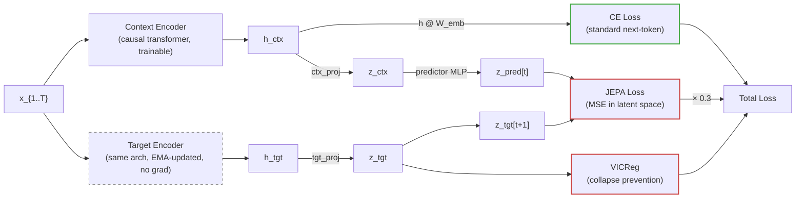

# [Non-Record] JEPA Self-Distillation for Autoregressive LM | Controlled A/B Shows No Gain Over Vanilla CE | Negative Results

**Track:** Non-record, unlimited compute, 16MB artifact
**Author:** Manav Pandey (MVPandey)
**val_bpb:** 1.1896 (JEPA, 11L) vs 1.1841 (vanilla CE, 11L), no meaningful difference
**Artifact:** ~16.3MB

## TL;DR

JEPA self-distillation with a moving EMA target encoder doesn't help autoregressive language modeling. A vanilla CE baseline trains faster and converges to the same (or slightly better) BPB. I'm pushing these results in the spirit of good science and in the hopes that the implementation and findings are useful to someone exploring a similar direction. I'm also actively looking for alternative approaches that might make SSL auxiliary objectives meaningful in this setting.

## The Idea

Full JEPA with an EMA target encoder as an auxiliary self-distillation objective. The context encoder is a causal transformer; the target encoder is an EMA copy (decay=0.9995) that provides slowly-evolving prediction targets. A predictor network learns to forecast what the target encoder will represent at the next token position.

My previous experience with JEPA was in constraint satisfaction (Sudoku solving via energy-based inference with Langevin dynamics, [github.com/MVPandey/Enso](https://github.com/MVPandey/Enso)). Adapting it to autoregressive token prediction required rethinking the target/context encoder relationship and figuring out which components actually matter.

Only the context encoder is saved in the artifact. The target encoder, predictor, and projection heads are training-only overhead.

## Architecture



### Backbone
- 11L or 20L, 512d, 8 attention heads (GQA with 4 KV heads)
- LeakyReLU(0.5)^2 MLP (3x), partial RoPE, QK RMSNorm, XSA last 4 layers
- U-Net skip connections, BigramHash, logit softcapping at 30.0
- Muon for weight banks, AdamW for scalars/embeddings

### JEPA Components (~393K params, training-only)
- Predictor: 2-layer MLP (256 -> GELU -> 256)
- ctx_proj: Linear(512, 256)
- tgt_proj: Linear(512, 256)

## Results: Controlled A/B Comparison

All runs: same seed (42), same hardware (8xH100), same wall time (30 min).

### 11L/512d (fits 16MB artifact)

| | **JEPA** | **Vanilla CE** |
|---|---------|---------------|
| Steps | 5,751 | **8,120** |
| Step time | 310ms | **222ms** |
| Val BPB (live) | 1.1811 | **1.1732** |
| Val BPB (int6 roundtrip) | 1.1896 | **1.1841** |
| Artifact | 16.3MB | 16.3MB |

### 20L/512d (over 16MB, for reference)

| | **JEPA** | **Vanilla CE** |
|---|---------|---------------|
| Steps | 3,635 | 3,617 |
| Step time | 495ms | 498ms |
| Val BPB (live) | 1.1537 | 1.1545 |
| Val BPB (int6 roundtrip) | 1.1590 | 1.1598 |

At 20L, step times were nearly identical because the JEPA path ran uncompiled while vanilla used torch.compile (an unfair advantage for vanilla that we caught via critic analysis). The 11L comparison fixes this (both uncompiled) and shows the real cost: JEPA adds ~40% step time overhead from the target encoder forward pass, resulting in 41% fewer training steps for the same wall time.

**Bottom line: vanilla CE wins by 0.005 BPB at 11L while being 40% faster.** JEPA is not just noise, it's actively worse when you account for compute.

## Core Finding

The JEPA auxiliary loss asks "can you predict what the target encoder's latent representation of the next token will be?" But CE is already asking "can you predict the next token?" With a small, well-structured BPE vocabulary (V=1024), these two objectives produce nearly identical gradient signals. The JEPA loss ends up being a strictly less informative version of what CE already provides. In vision, JEPA helps because pixel-level prediction is wasteful and latent prediction captures semantic structure that raw reconstruction misses. That asymmetry doesn't exist here: tokens are already semantic units.

## The Journey

### Energy-Based Output Heads (didn't work)

I started by replacing softmax with energy-based scoring in a learned latent space (CLIP-style cosine similarity with learnable temperature). Tried VICReg on the energy head output, deterministic sharpening Langevin at eval time. All produced identical BPB to standard softmax. Softmax is already an energy model with E(v) = -logit(v).

### Real JEPA with Target Encoder

Pivoted to actual JEPA with an EMA target encoder. Key things I learned along the way:

- **VICReg placement:** initially applied VICReg to the predictor output (z_pred), which was wrong. The target encoder is the tensor at risk of collapse since it only gets EMA updates. Switching to z_tgt fixed representation health (std went from 0.05 to ~1.05).
- **JEPA weight:** 1.0 was too high; the predictor couldn't track the target and the JEPA loss diverged. 0.3 with annealing to 0 during warmdown was stable.
- **Target EMA decay:** 0.996 too fast, 0.9995 stable.
- **LR warmup:** adding 200-step linear warmup eliminated early training instability.

### The Quantization Bug

First 20L run reported 1.15 BPB but artifact was 39.7MB. The `_cls` function checked for `.attn.` and `.mlp.` but unbanked names used `.a.` and `.m.`. Everything fell through to int8 instead of int6. Trained weights at int6 compress to ~0.34 bytes/param with LZMA, not the 0.16 I estimated from a random model test.

## Other Takeaways

1. **JEPA weight and EMA decay are tightly coupled.** High weight + fast EMA means the predictor can't track the target, causing rising loss and gradient competition. Low weight + slow EMA gives a stable but useless auxiliary signal.

2. **Don't test compression ratios on random models.** Trained weights have much higher entropy than randomly initialized ones. My random-model test showed 7.8MB for 48M params; the real artifact was 28MB.

## Concurrent Work

PR #832 independently explores JEPA for language modeling with a byte-level transformer. My approach uses a full EMA target encoder as the backbone rather than chunk-level prediction on top of a standard transformer.

## Reproduction

```bash
# jepa (11L, 30 min)
SEED=42 NUM_LAYERS=11 ITERATIONS=200000 MAX_WALLCLOCK_SECONDS=1800 \
WARMDOWN_ITERS=1000 VAL_LOSS_EVERY=500 RUN_ID=jepa_11L_30m \
torchrun --standalone --nproc_per_node=8 train_gpt.py

# vanilla baseline (11L, 30 min)
SEED=42 NUM_LAYERS=11 JEPA_WEIGHT=0 VICREG_VAR_WEIGHT=0 \
ITERATIONS=200000 MAX_WALLCLOCK_SECONDS=1800 WARMDOWN_ITERS=1000 \
VAL_LOSS_EVERY=500 RUN_ID=vanilla_11L_30m \
torchrun --standalone --nproc_per_node=8 train_gpt.py
```
