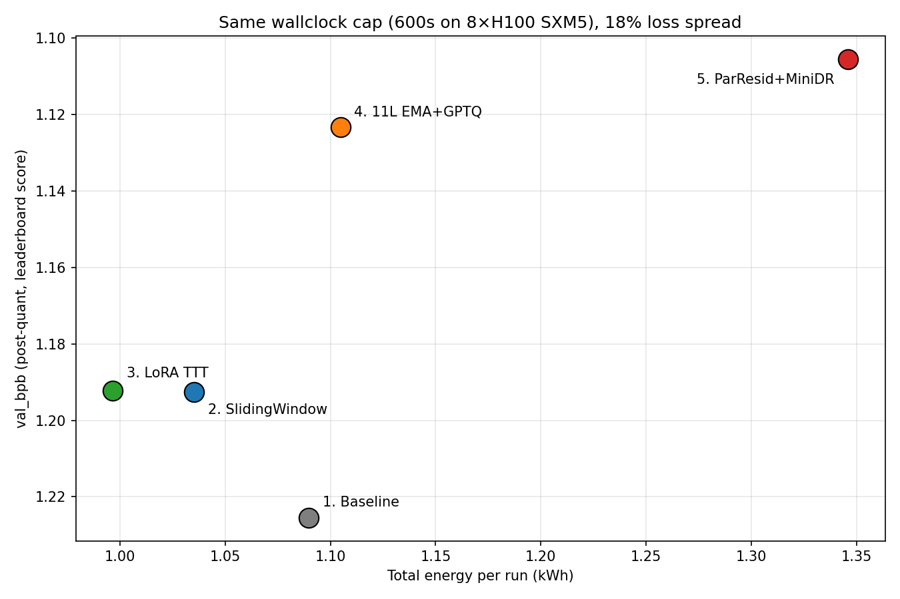
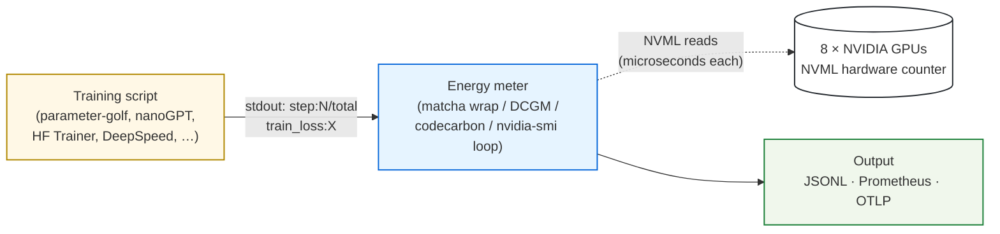
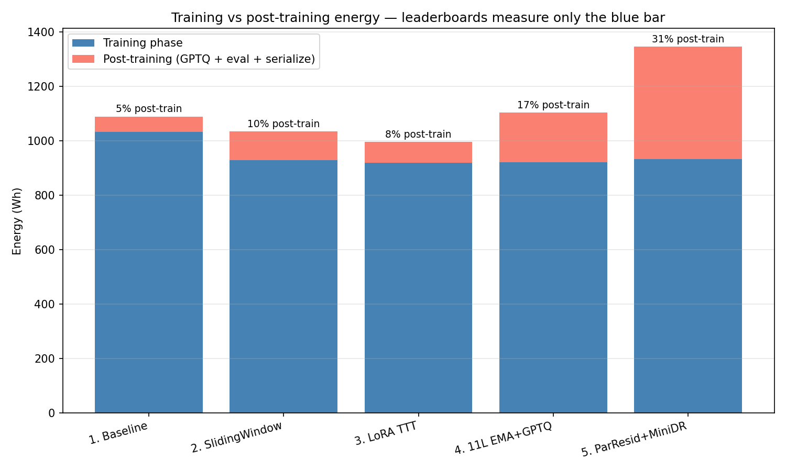
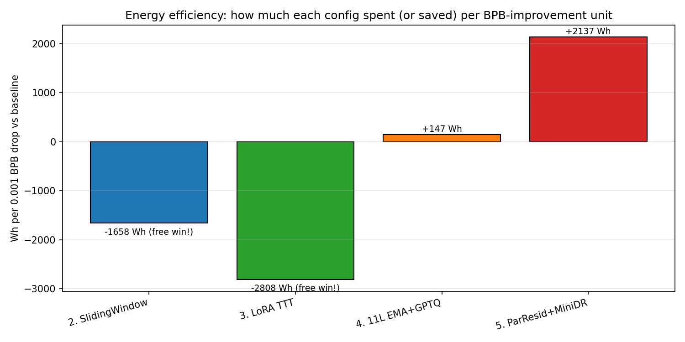
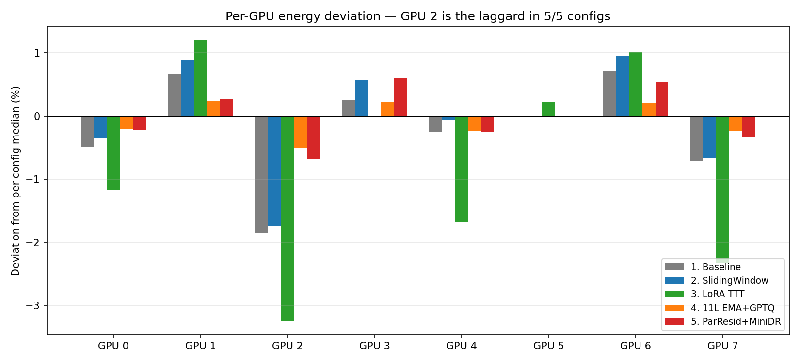

# Energy as the missing leaderboard axis

A reproducible study of 5 [parameter-golf](https://github.com/openai/parameter-golf) leaderboard submissions, instrumented with NVML hardware-counter energy measurement on 8×H100 SXM5.

> **TL;DR** — All 5 submissions hit the same 600-second wallclock cap, so total energy converges (~1.0–1.35 kWh per run). What varies is **energy per unit of `val_bpb` improvement** — and the spread is **14× between the most efficient and the least efficient technique**. None of this is visible from the published leaderboard.

<p align="center">
  
</p>

---

## What this is, in plain terms

Compute-capped LLM-training leaderboards (parameter-golf, modded-nanogpt, MLPerf Training, etc.) rank submissions on **quality** — `val_bpb`, perplexity, accuracy. They normalize compute time via wallclock caps. **They do not track the energy each submission burns.**

Two consequences:

1. Two submissions with the same final score can burn very different amounts of energy.
2. A submission that improves the score by N units can cost wildly different amounts of energy per unit of improvement than another.

This study measures the energy axis for 5 published parameter-golf submissions, on the exact hardware the leaderboard targets (8×H100 SXM5), so the comparison is apples-to-apples.

---

## How we measured it

The same idea works with any NVML-based tool — we used [matcha](https://github.com/keeyalabs/usematcha) here, but [DCGM](https://github.com/NVIDIA/DCGM), [codecarbon](https://github.com/mlco2/codecarbon), or even a `nvidia-smi` polling loop will do. The shape is:



Two properties make this work without slowing your training down:

- **Energy comes from a hardware register.** `nvmlDeviceGetTotalEnergyConsumption()` is one register read per GPU. No sampling required for the energy total.
- **Power sampling runs on a side thread.** Reading from training is a stdout pipe — microsecond cost per logged step.

No model code changes, no instrumented training loops, no recompilation. You wrap the existing `torchrun ...` command and the meter does the rest.

---

## What the leaderboard tracks vs what it misses

| Submission                        | `val_bpb` (leaderboard score) | Total energy (kWh) | Wh per 0.001 BPB-drop vs baseline |
| --------------------------------- | ----------------------------: | -----------------: | --------------------------------: |
| 1. NaiveBaseline                  |                    **1.2255** |              1.090 |                       — (anchor) |
| 2. SlidingWindow eval             |                    **1.1926** |              1.035 |          **−1,658 Wh** *(free win)* |
| 3. LoRA TTT                       |                    **1.1923** |              0.996 |          **−2,808 Wh** *(free win)* |
| 4. 11L EMA + GPTQ-lite            |                    **1.1233** |              1.105 |                          **+147 Wh** |
| 5. ParResid + Mini Depth Recur.   |                    **1.1055** |              1.346 |     **+2,137 Wh** *(14× less efficient)* |

The right two columns are what energy instrumentation adds. They surface three things invisible to a `val_bpb`-only leaderboard:

1. **Two configs hit the same loss (1.193) at near-identical energy via completely different paths** — same final score, very different mechanisms (sliding-window context vs per-document LoRA fine-tuning).
2. **The frontier is 14× less efficient than the engineering tier per unit of improvement.** Diminishing returns at the SP1024 ceiling are real and quantifiable.
3. **Post-training overhead is 5–31% of total energy** (quantization, eval, serialization) — invisible in any "training time" metric. For one config, autoregressive GPTQ calibration alone took 8 minutes of post-training GPU time.

---

## The data, in one expanded table

| # | Config | params | steps | `val_bpb` | Δbpb | kWh | duration | Wh/Mtok |
|---|---|---:|---:|---:|---:|---:|---:|---:|
| 1 | [NaiveBaseline](https://github.com/openai/parameter-golf/tree/main/records/track_10min_16mb/2026-03-17_NaiveBaseline) | 17.1 M | 13,793 | **1.2255** | anchor | 1.090 | 807 s | 0.151 |
| 2 | [SlidingWindowEval](https://github.com/openai/parameter-golf/tree/main/records/track_10min_16mb/2026-03-19_SlidingWindowEval) | 17.1 M | 13,766 | **1.1926** | −0.0329 | 1.035 | 773 s | 0.143 |
| 3 | [LoRA TTT](https://github.com/openai/parameter-golf/tree/main/records/track_10min_16mb/2026-03-17_LoRA_TTT) | 17.1 M | 13,339 | **1.1923** | −0.0332 | 0.996 | 734 s | 0.143 |
| 4 | [11L EMA + GPTQ-lite + warmdown3500](https://github.com/openai/parameter-golf/tree/main/records/track_10min_16mb/2026-03-22_11L_EMA_GPTQ-lite_warmdown3500_QAT015_1.1233) | 27.0 M | 7,034 | **1.1233** | −0.1022 | 1.105 | 888 s | 0.200 |
| 5 | [ParResid + Mini Depth Recurrence](https://github.com/openai/parameter-golf/tree/main/records/track_10min_16mb/2026-03-31_ParallelResiduals_MiniDepthRecurrence) | 30.2 M | 6,310 | **1.1055** | −0.1200 | 1.346 | 1300 s | 0.271 |

All 5 trained for the full 600 s wallclock cap on 8×H100 SXM5 (700 W TDP per GPU). Reproduced `val_bpb` matches each submission's published number within ±0.0011 BPB.

> **Wh/Mtok** = energy (Wh) per million training tokens processed (`total_energy_Wh ÷ (steps × tokens_per_step) × 1e6`). Normalizes energy across configs with different model sizes and batch sizes — answers *"how expensive is one token through this architecture?"* Bigger architectures cost more energy per token (more FLOPs per token) but also extract more loss-reduction per token; the slope is a useful diagnostic.

---

## Five findings

### 1. The wallclock cap is a hard equalizer for *training* energy.

Every submission hits the 600-second cap, so per-step energy and total *training* energy converge regardless of model size. Training-phase energy spans only **919–1033 Wh** (12% spread) across all 5 configs.

The dynamic range lives elsewhere — in **post-training overhead**, which varies from 5% to 31% of total run energy.

<p align="center">
  
</p>

The published "training time" metric (600 s) understates the true compute cost by **5% (baseline) to 117% (config 5)**. For the SP1024 frontier config (#5), nearly half the GPU-time happens *after* "training" formally ends — quantization calibration, sliding-window eval, serialization.

### 2. Two free wins: SlidingWindow eval and LoRA TTT both reduce loss AND energy vs baseline.

The improvement from `1.2255 → 1.193` (configs #2 and #3) cost **less** total energy than the baseline — both run their post-quantization eval more efficiently than the baseline does, and both fit slightly fewer training steps within the 600 s cap, balancing out.

<p align="center">
  
</p>

These are the only two "free wins" in the dataset. Everything below `1.193` requires real architectural work and burns more total energy.

### 3. Matched-loss A/B: SlidingWindow vs LoRA TTT.

Configs #2 and #3 land at essentially identical `val_bpb` (1.1926 vs 1.1923) via completely different mechanisms — sliding-window eval scoring tokens with richer context vs. per-document LoRA test-time training. Total energy is also nearly identical (1.035 vs 0.996 kWh).

The intuition that "TTT is expensive" did not hold at parameter-golf scale. The mechanisms reveal themselves in the eval-time energy split:

- **SlidingWindow eval** — stride=64 means each token is forward-passed ~16× → **72.6 s** of full-power eval
- **LoRA TTT** — per-document rank-8 LoRA updates are cheap → **63.6 s** of eval

Both routes to the same loss cost roughly the same energy, but they look very different in fine-grained per-step traces.

### 4. The frontier is 14× less energy-efficient than the engineering tier.

| Config            | Wh per 0.001 BPB-drop vs baseline |
|-------------------|----------------------------------:|
| 4. 11L EMA+GPTQ   |                       **147 Wh** |
| 5. ParResid+MiniDR |                      **2,137 Wh** |

Going from `1.123 → 1.105` (the last 0.018 BPB at the SP1024 ceiling) costs **14× more per unit of improvement** than going from `1.226 → 1.123`. Diminishing returns are real and quantifiable. The SP1024 leaderboard ended around `1.10` for exactly this reason — every entry below that switched to SP4096+ vocabularies, where the energy/loss curve resets.

### 5. The post-training tail is dominated by AR self-generated GPTQ calibration.

Config 5's 577-second "other" phase (between training-end and exit) is mostly autoregressive GPTQ calibration. From [`data/pg_logs/lb_par_resid_dr.txt`](data/pg_logs/lb_par_resid_dr.txt):

```
gptq:generating autoregressive calibration data (64 seqs x 2048 tokens, temp=0.80)...
gptq:generated 64 sequences in 245.9s
gptq:collecting hessians from autoregressive data...
gptq:done in 247.0s
wallclock:post_gptq total_elapsed:916.1s train_budget:600.0s
```

That's **~8 minutes of the model autoregressively generating its own calibration data** — a real compute cost invisible to any "training time" metric. The energy meter sees it because NVML keeps integrating energy until the wrapped process exits.

---

## Methodology sidebar: GPU 2 is the laggard in 5/5 runs.

<p align="center">
  
</p>

Across all 5 configs, GPU index 2 consistently consumes 0.5–3.2% less energy than the per-config median — a hardware-level pattern (likely binned/throttled silicon on this Runpod allocation), not algorithmic.

The straggle is most pronounced in **config 3 (LoRA TTT)** at 4.4% spread — TTT's per-document workload has more variance than uniform training-step work, so existing GPU asymmetries are amplified. Config 4 has the *tightest* spread (0.74%) — its larger model + larger batch better saturates per-GPU work, so per-GPU asymmetries are amortized.

This is observability the per-GPU NVML counter gives you "for free." Without it, the only signal you have is `nvidia-smi` snapshots — which can hide sustained 30 W per-GPU gaps perfectly well.

---

## Try this on your own training workload

Three steps. Tool-agnostic. Works on any NVIDIA GPU with NVML (every datacenter card from Pascal onward).

**1. Pick your training workload.**

Anything that prints `step:N/total ... loss:X` to stdout works without code changes. That covers parameter-golf, nanoGPT, modded-nanogpt, HuggingFace Trainer, DeepSpeed, most internal training scripts. Anything else: a 2-line patch to add step markers.

**2. Wrap with an energy meter.** Pick whichever fits your stack:

| Tool | Best for | Output |
|---|---|---|
| [matcha](https://github.com/keeyalabs/usematcha) | Per-step JSONL + per-GPU breakdown | `matcha wrap --output run.jsonl -- python train.py` |
| [DCGM](https://github.com/NVIDIA/DCGM) | Production ops, Grafana dashboards | Prometheus metrics |
| [codecarbon](https://github.com/mlco2/codecarbon) | CO₂-focused, Python decorator | CSV of carbon estimates |
| `nvidia-smi` polling loop | Quick sanity check, no install | Shell script + `awk` |

**3. Publish + iterate.** Compute the right efficiency metric — usually **Wh per Δquality unit** (loss / accuracy / val_bpb / etc.). Plot loss vs cumulative energy to see training trajectory and the efficiency frontier. Publish raw JSONL + analysis script so others can re-derive your numbers. If your community has a leaderboard, open an issue proposing energy as a tracked metric.

The setup cost is one wrap command. The output is data nobody else has — every published leaderboard run becomes a comparison point, and energy efficiency becomes a reviewable axis without changing existing scoring.

---

## Hardware and software

- **8× NVIDIA H100 80GB HBM3 SXM5** (700 W TDP per GPU; confirmed via `nvidia-smi --query-gpu=name,power.max_limit`)
- **Runpod pod 064ce247e933**, NVIDIA driver 580.126.09, parameter-golf official template
- **matcha 0.3.1** ([keeyalabs/usematcha](https://github.com/keeyalabs/usematcha)) — adds two regex patterns over 0.3.0 for parameter-golf's bare `N/total train_loss:` step format and TTT per-chunk progress lines (`tttg: cN/total`)
- **NVML energy source: hardware counter** (`nvmlDeviceGetTotalEnergyConsumption`), 100 ms polling for power, no sampling artifact on the energy total

Full hardware metadata: [`data/hardware.txt`](data/hardware.txt).

---

## Reproducing this study

```bash
# Clone, then from the repo root:
python3 scripts/analyze.py     # prints the merged loss + energy comparison table
python3 scripts/plot.py        # regenerates all 5 PNGs in figures/
```

Both scripts read from `data/matcha/*.jsonl` (per-step + session_end records) and `data/pg_logs/*.txt` (each submission's training log). Stdlib + matplotlib + numpy only — no heavy dependencies.

To regenerate the data on a fresh 8×H100 pod, the parameter-golf submission directories under [`records/track_10min_16mb/`](https://github.com/openai/parameter-golf/tree/main/records/track_10min_16mb) ship their own `train_gpt.py`. Wrap each with:

```bash
matcha wrap \
  --run-id <run_id> \
  --label config=<config_name> \
  --output runs/<run_id>.jsonl \
  -- torchrun --standalone --nproc_per_node=8 train_gpt.py
```

Specific env-var overrides per submission are quoted in [`notebook/report.ipynb`](notebook/report.ipynb) and in each submission's own README.

---

## Caveats and known limitations

- **Single-seed runs.** Each config was reproduced with one seed. Published leaderboard numbers are 3-seed means. Our `val_bpb` matches published values within ±0.0011 BPB — well below the leaderboard's 0.005-nat significance threshold. Energy figures are reproducible to ~5–10% on identical hardware (Runpod allocation variance dominates).
- **Config 4 artifact size: 17.05 MB (over the 16 MB cap).** The published submission used `zstd-22` compression; our run defaulted to `zlib`. The `val_bpb` measurement is unaffected (compression is post-training; only changes disk size). Methodology footnote, not a measurement issue.
- **No SP4096 / SP8192 configs.** The HuggingFace data mirrors that hosted larger-vocabulary FineWeb shards (per the published submission READMEs) had been depopulated by the time of this study. SP1024 ceiling is ~1.10 BPB; reaching the current SOTA (~1.06) requires SP8192 datasets we couldn't materialize. The SP1024 frontier config (#5) is the lowest reproducible point in this study.
- **GPU 2 straggle is hardware-level**, observed across all 5 runs on the same Runpod pod. A different allocation likely gives a different straggle pattern (or none).

---

## Submission contents

When this study is mirrored into `records/track_non_record_16mb/2026-04-29_Energy_Instrumentation_5Configs/` (see [`PR_INSTRUCTIONS.md`](PR_INSTRUCTIONS.md)), the directory contains:

- `README.md` — this writeup
- `submission.json` — non-record metadata (configs measured, energy/loss ranges, hardware, instrumentation tool)
- `data/matcha/lb_*.jsonl` — raw matcha JSONL records (5 files: per-step + session_end energy, power, train_metrics)
- `data/pg_logs/lb_*.txt` — each submission's own training log (5 files: includes `final_int8_zlib_roundtrip val_bpb:...` and post-quant detail)
- `data/hardware.txt` — `nvidia-smi -L`, matcha version, per-GPU TDP
- `notebook/report.ipynb` — Jupyter notebook used for chart iteration
- `scripts/analyze.py` — prints the merged comparison table from raw data
- `scripts/plot.py` — regenerates all 5 figures from raw data
- `figures/*.png` — 5 PNGs: hero scatter, loss trajectory, energy efficiency, train vs post-train, per-GPU deviation

Total artifact size: ~1.5 MB. No model weights — this is methodology + measurements only.

---

## Repo layout

```
parameter-golf-energy-study/
├── README.md                                    ← this file
├── data/
│   ├── matcha/lb_*.jsonl                        (5 files: per-step + session_end records)
│   ├── pg_logs/lb_*.txt                         (5 files: parameter-golf training logs)
│   └── hardware.txt                             nvidia-smi -L + matcha --version + TDPs
├── notebook/report.ipynb                        Jupyter notebook used for chart iteration
├── scripts/
│   ├── analyze.py                               prints the merged comparison table
│   └── plot.py                                  regenerates the 5 figures from raw data
└── figures/
    ├── 01_hero_loss_vs_energy.png               article opener
    ├── 02_loss_vs_cumulative_energy.png         training trajectories
    ├── 03_energy_efficiency.png                 Wh per 0.001 BPB-drop bars
    ├── 04_train_vs_post_train_energy.png        stacked energy share
    └── 05_per_gpu_deviation.png                 GPU 2 straggle sidebar
```

---

## License & attribution

This study reproduces published [parameter-golf](https://github.com/openai/parameter-golf) submissions; full credit to the original authors of each submission (links in the data table above). The matcha instrumentation tool: [keeyalabs/usematcha](https://github.com/keeyalabs/usematcha) (Apache-2.0). This repository's own contributions (analysis scripts, README, figures) are released under the same terms.
